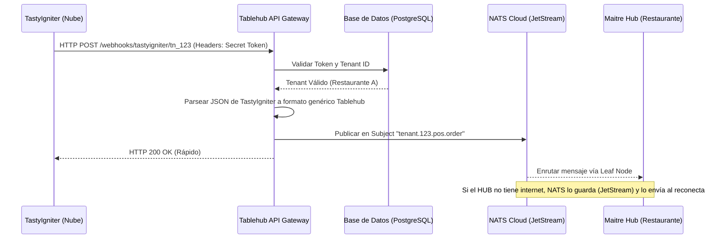

# Integración Cloud POS: Frontend (Panel SaaS)

Para que el dueño del restaurante pueda conectar su Cloud POS (como TastyIgniter o Toast), necesita una interfaz en el **Panel de Administración SaaS de Tablehub** donde pueda obtener los datos necesarios (URL y Token) para configurarlo.

## 1. Experiencia de Usuario (Flujo de UI)

El restaurante iniciará sesión en su panel de Tablehub en la nube y seguirá este flujo:

1. **Navegación:** Ir a `Configuración` > `Integraciones`.
2. **Selección del POS:** Verá una cuadrícula (grid) con los logos de los sistemas soportados (TastyIgniter, Toast, Square, etc.). Hará clic en "Conectar" en el que utilice.
3. **Generación de Credenciales:** El sistema generará automáticamente dos piezas de información cruciales que el usuario debe copiar.
4. **Instrucciones:** La misma pantalla le mostrará un paso a paso de dónde pegar esa información en su POS.

## 2. Pantalla de Configuración de la Integración

Cuando el usuario selecciona "TastyIgniter", por ejemplo, verá una tarjeta con la siguiente información:

### A. Webhook URL (Endpoint)
Esta es la dirección a la que el POS enviará los datos. El frontend solicitará esta URL al backend.
```text
URL de Webhook:
https://api.tablehub.io/v1/webhooks/tastyigniter/tn_9a8b7c6d5e
```
*(Se incluye un botón de "Copiar al portapapeles" al lado de la URL)*.

### B. Secret Token (API Key)
Este es el "password" que el POS usará para verificar que los datos realmente van hacia la cuenta correcta y de forma segura.
> [!WARNING]
> El Secret Token solo se muestra una vez por motivos de seguridad. Si el usuario lo pierde, tendrá que generar uno nuevo (lo que invalidará el anterior).

```text
Secret Token:
th_sk_live_5x9Q2pL8mN4vR1jK0wZ7yX3bC6
```
*(Se incluye un botón de "Copiar al portapapeles")*.

## 3. Guía Paso a Paso para el Usuario (Mostrada en el UI)

En la misma pantalla, se le debe mostrar al usuario qué hacer con esos datos. Ejemplo para TastyIgniter:

> **¿Cómo configurar TastyIgniter?**
> 1. Inicia sesión en el panel de administrador de tu TastyIgniter.
> 2. Ve a **System** > **Webhooks**.
> 3. Haz clic en **New Webhook**.
> 4. En el campo *Payload URL*, pega la **URL de Webhook** que copiaste arriba.
> 5. En el campo *Secret*, pega el **Secret Token** que copiaste arriba.
> 6. En *Events*, selecciona `order.created` o `order.updated`.
> 7. Guarda los cambios. ¡Listo! Tablehub ahora recibirá tus pedidos.

## 4. Estado de la Integración (Feedback Visual)

El frontend debe mostrar si la integración está funcionando.
- **Estado: Esperando primer evento...** (Punto naranja). Muestra este estado apenas se genera el webhook.
- **Estado: Conectado** (Punto verde). Se actualiza automáticamente (vía WebSocket/NATS al frontend del dashboard SaaS) tan pronto el backend recibe el primer webhook exitoso desde el POS.
- **Botón "Desconectar/Revocar":** Permite al usuario destruir el webhook si cambia de POS o si cree que su clave fue comprometida.

## 5. Diseño del Componente (Referencia)

```markdown
+-------------------------------------------------------------+
|  [Logo TastyIgniter]  Configurar Integración                |
+-------------------------------------------------------------+
|                                                             |
|  Paso 1: Copia tu información de conexión                   |
|                                                             |
|  Webhook URL:                                               |
|  [ https://api.tablehub.io/v1/webhooks/.... ] [Copiar]      |
|                                                             |
|  Secret Token:                                              |
|  [ th_sk_live_5x9Q2pL8mN...                 ] [Copiar]      |
|                                                             |
|-------------------------------------------------------------|
|                                                             |
|  Paso 2: Configura tu POS                                   |
|  1. Ve a System > Webhooks en TastyIgniter.                 |
|  2. Pega la URL y el Secret en los campos correspondientes. |
|                                                             |
|  [ Probar Conexión ]           Estado: 🟢 Activo            |
+-------------------------------------------------------------+
```

---

# Integración Cloud POS: Backend (SaaS API Gateway)

Este documento detalla cómo el Backend de Tablehub SaaS en la nube maneja las peticiones entrantes desde los Cloud POS (TastyIgniter, Toast, etc.) y las envía al Maitre Hub local.

## 1. Arquitectura del Flujo



## 2. Componentes del Backend

### A. Endpoint de Recepción (Webhook Handler)
El backend expondrá URLs públicas y dinámicas por cada restaurante:
`POST https://api.tablehub.io/v1/webhooks/{provider}/{tenant_id}`

Ejemplo: `/webhooks/tastyigniter/tn_9a8b7c6d5e`

### B. Validación de Seguridad (Middleware)
No podemos confiar ciegamente en las peticiones HTTP. Cuando llega el POST:
1. El middleware extrae el **Secret Token** de los headers (ej. `X-Signature` o `Authorization`).
2. Lo compara con el hash almacenado en la base de datos para ese `{tenant_id}`.
3. Si falla, devuelve `HTTP 401 Unauthorized` al POS.
4. Si es válido, la petición pasa al traductor.

> [!IMPORTANT]
> Los Webhook Tokens deben guardarse encriptados o hasheados en la base de datos (como contraseñas con bcrypt o SHA-256) para que, en caso de filtración de la BD, nadie pueda falsificar pedidos.

### C. Traductor de Payloads (Parser)
Cada POS envía los datos de forma diferente. TastyIgniter tiene un JSON, Toast tiene otro.
El backend usa el `{provider}` de la URL para saber qué "Traductor" usar.
- Toma el JSON específico de TastyIgniter.
- Extrae: Número de orden, ítems, modificadores, nombre del cliente.
- Lo transforma a un `StandardTablehubOrder{}` (el formato universal que entiende el Maitre Hub local).

### D. Puente hacia NATS (Publisher)
Una vez el JSON está estandarizado, el Backend ya no hace más trabajo HTTP. 
Se conecta al servidor NATS de la nube y publica el mensaje en un canal privado del restaurante:

```go
subject := fmt.Sprintf("tenant.%s.pos.order.received", tenantID)
payload, _ := json.Marshal(standardOrder)

// Usamos JetStream para garantizar entrega
_, err := js.Publish(subject, payload)
```

## 3. Gestión del Estado (Offline Mode)

La magia ocurre después del `js.Publish`. 
Al usar NATS JetStream en el SaaS:
1. **Respuesta Rápida:** El backend responde `200 OK` al POS inmediatamente después de guardar en NATS. El POS no se queda colgado esperando.
2. **Cola de Mensajes:** NATS intentará enviar el mensaje por el "Leaf Node" (la conexión persistente) hacia la IP local del restaurante.
3. **Corte de Internet:** Si el restaurante no tiene internet, el mensaje no se pierde. NATS Cloud lo retiene en disco de forma segura.
4. **Reconexión:** Cuando el router del restaurante vuelve a tener internet, el Maitre Hub se reconecta al SaaS automáticamente. NATS Cloud le envía todos los pedidos acumulados en el orden exacto en que llegaron.

## 4. Base de Datos (Estructura Sugerida)

Se necesitará una tabla `pos_integrations`:
- `id` (UUID)
- `tenant_id` (Relación al Restaurante)
- `provider` (String: "tastyigniter", "toast", etc.)
- `webhook_url_slug` (String único: "tn_9a8b7c6d5e")
- `hashed_secret_token` (String: Hash bcrypt del token visible al usuario)
- `is_active` (Booleano)
- `last_webhook_received_at` (Timestamp: Para actualizar el puntito verde del UI)
