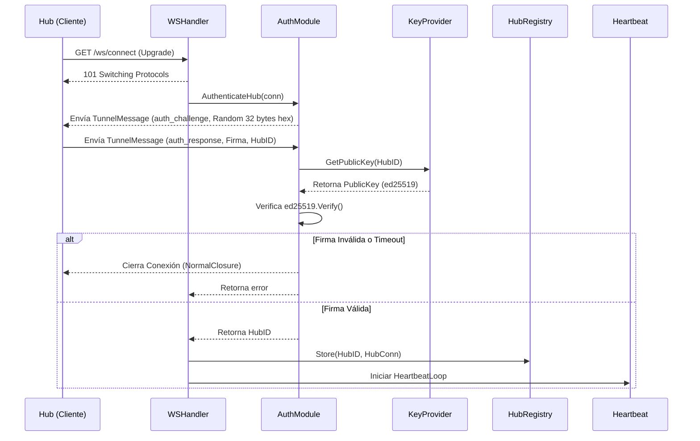

# Plan de Implementación Detallado: Fase 3 - WebSocket Manager

## Objetivo
Desarrollar el gestor de conexiones WebSocket (`ws`) en la capa de infraestructura del Tablehub Cloud. Este módulo será responsable de mantener los túneles seguros con los dispositivos Hub, manejar su ciclo de vida, autenticación criptográfica, asegurar una alta concurrencia mediante un registro fragmentado (sharded registry), y permitir el enrutamiento bidireccional de mensajes.

## Decisiones de Arquitectura y Negocio
- **Identidad del Hub (`HubID`):** A diferencia de las asunciones básicas previas, la llave primaria para el registry será el `HubID`. Esto asegura soporte para múltiples Hubs operando para un mismo restaurante, vital para cadenas o locales grandes sin red mesh.
- **Desacoplamiento de Base de Datos:** La validación de firmas se realizará a través de una interfaz abstracta `KeyProvider`. En la Fase 3, esto mantendrá el alcance limpio (testeable con Mocks); en la Fase 4, se conectará al repositorio PostgreSQL.
- **Tolerancia a Fallos y Concurrencia:** Goroutines separadas (`readPump` y `writePump`) por conexión, junto con un mapa de registro segmentado en 256 fragmentos para evitar "lock contention" (bloqueos de mutex) durante alta concurrencia.

---

## 1. Definición de Modelos y Contratos (`types.go`)

Definiremos las estructuras exactas de datos que viajan por el socket y los contratos internos.

```go
package ws

import "time"

// TunnelMessage es el contenedor estándar para la comunicación bidireccional
type TunnelMessage struct {
    Event     string      `json:"event"`
    Timestamp int64       `json:"timestamp"`
    Payload   interface{} `json:"payload"` // Payload genérico según el Event
}

// Estructuras para el Handshake inicial de Autenticación
type ChallengePayload struct {
    ChallengeHex string `json:"challenge_hex"`
}

type AuthResponsePayload struct {
    RestaurantID string `json:"restaurant_id"`
    HubID        string `json:"hub_id"`
    SignatureHex string `json:"signature_hex"`
}

// KeyProvider abstrae la obtención de la llave pública de un Hub
type KeyProvider interface {
    GetPublicKey(hubID string) ([]byte, error)
}
```

---

## 2. Flujo de Conexión y Autenticación (`auth.go` & `handler.go`)

El `UpgradeHandler` orquestará la conexión inicial, delegando la criptografía al módulo de autenticación.

### Diagrama de Secuencia del Handshake


---

## 3. Registro y Ruteo de Conexiones (`hub_registry.go`)

El registro necesita alta disponibilidad de lectura (para enrutar) y escritura rápida (durante reconexiones masivas).

```go
type Shard struct {
    sync.RWMutex
    connections map[string]*HubConn
}

type HubRegistry struct {
    shards [256]*Shard
}

// Métodos del Registro:
// - getShard(hubID string) *Shard (utiliza algoritmo FNV-1a para el hash del string)
// - Store(hubID string, conn *HubConn): 
//   ⚠️ Lógica vital: Si ya existe una conexión guardada con ese HubID (stale connection), 
//   llama a la función de cierre de la anterior antes de registrar la nueva.
// - Get(hubID string) *HubConn
// - Delete(hubID string)
// - SendToHub(hubID string, msg TunnelMessage) error
// - Shutdown(): Para Graceful Shutdown. Itera sobre todos los shards y cierra conexiones.
```

---

## 4. Ciclo de Vida de la Conexión (`hub_conn.go` & `heartbeat.go`)

Las conexiones en Go WebSockets no son seguras para concurrencia simultánea en escritura. Usaremos el patrón de "Pumps".

```go
type HubConn struct {
    conn      *websocket.Conn
    hubID     string
    send      chan []byte           // Canal bufferizado, maneja los envíos asíncronos
    cancelCtx context.CancelFunc    // Detiene los procesos en background al cerrar
}
```

### Rutinas Background:

1. **`readPump()` (Lectura)**: 
   - Goroutine en loop infinito con `conn.ReadMessage()`.
   - **Seguridad:** Utiliza `SetReadLimit(config.MaxMessageSize)` para mitigar ataques DoS por agotamiento de RAM.
   - Detecta respuestas al Ping (mensajes de Pong del cliente) y reinicia el `SetReadDeadline`.

2. **`writePump()` (Escritura)**:
   - Dedicada exclusivamente a leer del canal `send` y enviar al socket de red.
   - Aplica `SetWriteDeadline` antes de cada `conn.WriteMessage()`. Si el envío se traba, cierra la conexión.

3. **`heartbeat.go` (Keep-Alive)**:
   - Un loop controlado por `context.Context` que despierta según un `time.Ticker`.
   - **Jitter Aleatorio:** Para evitar que miles de Hubs sincronizados formen un pico de tráfico ("Thundering Herd"), el intervalo de Ping varía en un ±15% de manera aleatoria por conexión.
   - Si no hay respuesta tras el `PongWait`, la conexión se considera muerta y ejecuta `cancelCtx()`.

---

## 5. Parámetros de Configuración (`config.go`)

Inyectables para ajustar la performance en producción.

```go
type WSConfig struct {
    WriteWait      time.Duration // Max time para escribir al socket (ej. 10s)
    PongWait       time.Duration // Tiempo de tolerancia sin pong (ej. 60s)
    PingPeriod     time.Duration // Frecuencia de ping, debe ser < PongWait (ej. 54s)
    MaxMessageSize int64         // Límite de bytes del payload entrante (ej. 4096)
    SendBufferSize int           // Tamaño en memoria del canal (ej. 256 mensajes)
}
```

---

## Plan de Verificación (Verification Plan)

### 1. Test Unitario Criptográfico (`auth_test.go`)
Mockear el `KeyProvider` retornando llaves de prueba. Inyectar tráfico falso a la función de autenticación y verificar que rechace firmas truncadas o incorrectas, y pase firmas originadas por `ed25519.Sign`.

### 2. Test Anti-Data Race (`registry_test.go`)
Crear un test que invoque `Store`, `Get`, y `Delete` simultáneamente usando cientos de goroutines.
- Ejecutar: `go test ./internal/infrastructure/ws/... -v -race`
- Validar que no haya colisiones de memoria.

### 3. Test Manual de Integración
Conectaremos un cliente de prueba al puerto, validaremos el Handshake completo y el intercambio bidireccional mediante los túneles `readPump` y `writePump`. Validaremos en los logs (`zerolog`) que el `HubID` se rastrea correctamente a lo largo del flujo.
