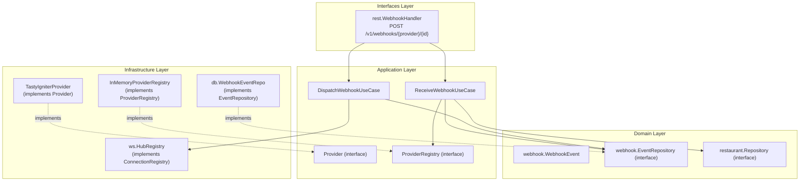

# Plan de Implementación: Fase 6 — Sistema de Webhooks (Revisado)

Este documento integra el plan original con las correcciones de **Mimo** y los hallazgos críticos de **DeepSeek** sobre concurrencia, seguridad y propagación de contexto.

## ⚠️ User Review Required

> [!IMPORTANT]
> **Cambios Clave Tras la Revisión de Mimo y DeepSeek:**
> 1. **Prerequisito: Refactorizar `restaurant.Repository`** (DeepSeek #3 🔴): Añadir `context.Context` a todos los métodos antes de empezar Fase 6. Hay inconsistencia con `hub.Repository` que ya lo tiene.
> 2. **Timing-Safe Token Validation** (DeepSeek #7 🔴): Usar `crypto/subtle.ConstantTimeCompare` para evitar timing attacks. El token es el único factor de autenticación del endpoint.
> 3. **Retry Cancelable** (DeepSeek #1 🟡): No usar `time.Sleep` directo. Usar `select` con `ctx.Done()` y `time.After()` para que el retry respete cancelación/timeout.
> 4. **Audit-First Error Handling** (DeepSeek #5): Si `LogEvent` falla, el handler responde 500 y NO se ejecuta dispatch. El proveedor reintentará.
> 5. **Idempotency Key** (DeepSeek #8): Añadir `idempotency_key` a la tabla para deduplicación de webhooks reenviados.
> 6. **Provider Interface en Capa de Aplicación** (Mimo #7): Mover `Provider` y `ProviderRegistry` interfaces a la capa de aplicación. Solo las implementaciones concretas viven en infraestructura.
> 7. **Send() ≠ Entrega Garantizada** (DeepSeek #6): Documentado como known limitation. ACK del hub se implementará en Fase 7.

---

## Proposed Changes

### 0. Prerequisito: Refactorizar `restaurant.Repository` con Context

#### [MODIFY] `cloud/internal/domain/restaurant/restaurant.go`
- Añadir `context.Context` como primer parámetro a todos los métodos de `Repository`:
  - `Create(ctx, r)`, `GetByID(ctx, id)`, `GetBySlug(ctx, slug)`, `List(ctx, limit, offset)`, `Update(ctx, r)`, `Delete(ctx, id)`

#### [MODIFY] `cloud/internal/infrastructure/db/restaurant_repo.go`
- Actualizar implementación para propagar el contexto recibido en lugar de `context.Background()`.

---

### 1. Migración SQL

#### [NEW] `cloud/internal/infrastructure/db/migrations/002_webhook_events.sql`

```sql
CREATE TABLE webhook_events (
    id                UUID PRIMARY KEY DEFAULT uuid_generate_v4(),
    restaurant_id     UUID NOT NULL REFERENCES restaurants(id) ON DELETE CASCADE,
    provider          TEXT NOT NULL,
    event_type        TEXT NOT NULL,
    payload           JSONB NOT NULL,
    idempotency_key   TEXT,
    status            TEXT NOT NULL DEFAULT 'received'
                      CHECK (status IN ('received', 'delivered', 'failed', 'hub_offline')),
    retry_count       INT NOT NULL DEFAULT 0,
    hub_id            TEXT,
    error_detail      TEXT,
    received_at       TIMESTAMPTZ NOT NULL DEFAULT NOW(),
    delivered_at      TIMESTAMPTZ
);

-- Índice compuesto para la query principal (listado por restaurante)
CREATE INDEX idx_webhook_events_restaurant_received
    ON webhook_events(restaurant_id, received_at DESC);

-- Índice único parcial para idempotencia (dedup de proveedores)
CREATE UNIQUE INDEX idx_webhook_idempotency
    ON webhook_events(restaurant_id, idempotency_key)
    WHERE idempotency_key IS NOT NULL;

-- Índice para monitoreo por status
CREATE INDEX idx_webhook_events_status_received
    ON webhook_events(status, received_at DESC);

-- Trigger updated_at no aplica (append-heavy, no se actualiza frecuentemente)
```

**Columnas añadidas por revisión:**
| Columna | Origen | Razón |
|---------|--------|-------|
| `idempotency_key` | DeepSeek #8 | Dedup de webhooks reenviados por el proveedor |
| `retry_count` | Mimo #3 | Trazabilidad de cuántos reintentos se hicieron |
| `hub_id` | Mimo #3 | Saber a qué hub específico se entregó |

---

### 2. Capa de Dominio (`cloud/internal/domain/webhook/`)

#### [NEW] `webhook.go`
- **`EventStatus`** — Enum: `StatusReceived`, `StatusDelivered`, `StatusFailed`, `StatusHubOffline`
- **`WebhookEvent`** — Registro de un evento webhook:
  - `ID uuid.UUID`, `RestaurantID`, `Provider`, `EventType`
  - `Payload json.RawMessage`, `IdempotencyKey *string`
  - `Status EventStatus`, `RetryCount int`, `HubID *string`
  - `ErrorDetail *string`, `ReceivedAt time.Time`, `DeliveredAt *time.Time`

#### [NEW] `errors.go`
- `ErrInvalidToken`, `ErrUnsupportedProvider`, `ErrEventNotFound`, `ErrDuplicateEvent` (idempotency)

#### [NEW] `repository.go`
- **`EventRepository`** interface (todos con `context.Context`):
  - `LogEvent(ctx, event *WebhookEvent) error`
  - `UpdateEventStatus(ctx, eventID uuid.UUID, status EventStatus, retryCount int, hubID *string, errorDetail *string) error`
  - `GetEventsByRestaurant(ctx, restaurantID types.RestaurantID, limit, offset int) ([]*WebhookEvent, error)`

---

### 3. Capa de Aplicación (`cloud/internal/application/webhook/`)

#### [NEW] `provider.go` — Interfaces de Provider (Mimo #7: en capa de aplicación)
```go
// Provider abstracts a webhook source (TastyIgniter, UberEats, etc.)
type Provider interface {
    Name() string
    ValidateRequest(r *http.Request, secret string) error
    ParsePayload(r *http.Request) (eventType string, idempotencyKey string, payload json.RawMessage, err error)
}

// ProviderRegistry manages registered webhook providers.
type ProviderRegistry interface {
    Register(provider Provider)
    Get(name string) (Provider, error)
}
```

#### [NEW] `receive_webhook.go` — ReceiveWebhookUseCase
- **Dependencias**: `restaurant.Repository`, `webhook.EventRepository`, `ProviderRegistry`
- **Flujo**:
  1. `ProviderRegistry.Get(providerName)` → obtiene el Provider.
  2. `restaurant.Repository.GetByID(ctx, restaurantID)` → obtiene el Restaurant y `Settings.WebhookToken`.
  3. `Provider.ValidateRequest(r, secret)` → timing-safe validation.
  4. `Provider.ParsePayload(r)` → extrae `eventType`, `idempotencyKey`, `payload`.
  5. `webhook.EventRepository.LogEvent(ctx, event)` → persiste con status `received`.
  6. **Si LogEvent falla → retorna error (audit-first). No se ejecuta dispatch.**
  7. Retorna `*WebhookEvent` creado.

#### [NEW] `dispatch_webhook.go` — DispatchWebhookUseCase
- **Dependencias**: `tunnel.ConnectionRegistry`, `webhook.EventRepository`
- **Flujo**:
  1. `ConnectionRegistry.GetByRestaurantID(restaurantID)` → obtiene `Sender`.
  2. Si hub offline → actualizar evento a `hub_offline`, retornar error 503.
  3. Construir `TunnelMessage{Event: eventType, Payload: payload}`.
  4. `Sender.Send(msg)` → intentar envío.
  5. **Retry cancelable** (máximo 2 intentos, backoff 500ms → 1s):
     ```go
     select {
     case <-ctx.Done(): return ctx.Err()
     case <-time.After(delay): // retry
     }
     ```
  6. Actualizar evento en DB: `delivered` (éxito) o `failed` (todos los intentos fallaron).

> [!WARNING]
> **Known Limitation (DeepSeek #6):** `Send()` exitoso solo significa que el mensaje se encoló en el buffer del HubConn. Si el `writePump` falla al escribir al WebSocket, el mensaje se pierde silenciosamente. Se marcará como `delivered` en DB pero el hub nunca lo recibió. Solución futura: ACK del hub (Fase 7).

---

### 4. Capa de Infraestructura

#### [NEW] `cloud/internal/infrastructure/webhook/provider_registry.go`
- Implementación concreta de `webhook.ProviderRegistry` (mapa en memoria).

#### [NEW] `cloud/internal/infrastructure/webhook/tastyigniter.go`
- Implementa `webhook.Provider`:
  - `Name()` → `"tastyigniter"`
  - `ValidateRequest()`:
    - Extrae token de `X-TastyIgniter-Token` header o query param `token`.
    - **Usa `crypto/subtle.ConstantTimeCompare()`** (DeepSeek #7).
  - `ParsePayload()`:
    - Decodifica JSON body.
    - Extrae `event_type` del payload TastyIgniter o fallback `"order.created"`.
    - Extrae `idempotency_key` si disponible en el payload.

#### [NEW] `cloud/internal/infrastructure/db/webhook_event_repo.go`
- Implementación PostgreSQL de `webhook.EventRepository`.
- `LogEvent`: INSERT con `ON CONFLICT (restaurant_id, idempotency_key) DO NOTHING` para idempotencia.
- `UpdateEventStatus`: UPDATE con timestamp de delivery y retry_count.

---

### 5. Capa de Interfaces

#### [NEW] `cloud/internal/interfaces/rest/webhook_handler.go`
- **`WebhookHandler`**:
  - Endpoint: `POST /v1/webhooks/{provider}/{restaurant_id}`
  - Flujo: `ReceiveWebhookUseCase.Execute()` → `DispatchWebhookUseCase.Execute()`
  - Responses:
    - `200 {"status":"delivered"}` — éxito
    - `400` — payload inválido / proveedor desconocido
    - `401` — token inválido
    - `404` — restaurante no encontrado
    - `500` — error interno (DB, LogEvent fallido)
    - `503` — hub offline

#### [MODIFY] `cloud/internal/interfaces/rest/router.go`
- Añadir: `r.Post("/v1/webhooks/{provider}/{restaurant_id}", webhookHandler.HandleWebhook)`
- Pasar `WebhookHandler` como parámetro de `NewRouter()`.

#### [MODIFY] `cloud/cmd/server/main.go`
- Wiring:
  - `providerRegistry` con TastyIgniter registrado
  - `webhookEventRepo`
  - `receiveUC`, `dispatchUC`
  - `webhookHandler`
  - Pasar al router.

---

## Diagrama de Arquitectura



---

## Flujo de Request Completo

```
POST /v1/webhooks/tastyigniter/abc-123
Header: X-TastyIgniter-Token: <secret>
Body: {"order_id": "42", "event": "order.created", ...}
    │
    ▼
┌──────────────────────────────────────┐
│  WebhookHandler                      │
│  provider="tastyigniter", restID=abc │
└──────────┬───────────────────────────┘
           │
           ▼
┌──────────────────────────────────────┐
│  ReceiveWebhookUseCase               │
│  1. ProviderRegistry.Get("tastyig")  │
│  2. RestaurantRepo.GetByID(ctx,abc)  │
│  3. Provider.Validate(r, token)      │ ← subtle.ConstantTimeCompare
│  4. Provider.ParsePayload(r)         │
│  5. EventRepo.LogEvent(ctx, event)   │ ← audit-first: fallo = 500
│  ↓ return WebhookEvent               │
└──────────┬───────────────────────────┘
           │
           ▼
┌──────────────────────────────────────┐
│  DispatchWebhookUseCase              │
│  1. Registry.GetByRestaurantID(abc)  │
│  2. if offline → status=hub_offline  │
│  3. Sender.Send(TunnelMessage)       │
│  4. Retry: 500ms → 1s (cancelable)  │ ← select ctx.Done()/time.After
│  5. EventRepo.UpdateStatus(...)      │
└──────────┬───────────────────────────┘
           │
           ▼
  200 {"status":"delivered"}
  503 {"error":"hub offline"}
```

---

## Known Limitations (Documentadas)

| Limitation | Severidad | Fase Futura |
|---|---|---|
| `Send()` exitoso ≠ entrega garantizada (no hay ACK del hub) | 🟡 Media | Fase 7 |
| TOCTOU race entre GetByRestaurantID y Send (hub se desconecta mid-flight) | 🟡 Media | Fase 7 (sender handles) |
| No hay cola offline (si hub offline, solo se marca el status) | 🟢 Baja | Fase 8+ |

---

## Verification Plan

### Pruebas Unitarias
- `go test ./internal/application/webhook/...` — Mocks de Repository, ConnectionRegistry, Provider:
  - Token válido → delivered
  - Token inválido → 401 (timing-safe)
  - Hub offline → status hub_offline, response 503
  - Retry: primer intento falla, segundo éxito
  - Proveedor desconocido → 400
  - LogEvent fallo → 500, dispatch no se ejecuta
  - Idempotency key duplicada → no duplica evento
  - Context cancelado durante retry → cancelación limpia

### Verificación End-to-End
1. `POST /v1/webhooks/tastyigniter/{id}` con token válido → 200
2. `POST /v1/webhooks/tastyigniter/{id}` con token inválido → 401
3. `POST /v1/webhooks/unknown/{id}` → 400
4. Verificar que el hub recibe el `TunnelMessage` vía WebSocket
5. Verificar que `webhook_events` tiene el registro con status correcto
6. Comparar comportamiento con `main_legacy.go`

### Compilación
- `go build ./...` — sin errores
- `go vet ./...` — sin warnings
- `go test ./... -race` — zero data races

---

## Open Questions

> [!IMPORTANT]
> **¿Webhook Token por Proveedor?** El schema actual tiene un único `webhook_token` en `restaurant.Settings`. ¿Debería haber un token diferente por proveedor? Por ahora un único token genérico. Evolucionar si se necesita.

> [!NOTE]
> **Offline Queue** — Si el hub está offline, el evento se marca como `hub_offline` pero NO se encola. La cola offline es tema de una fase posterior.
