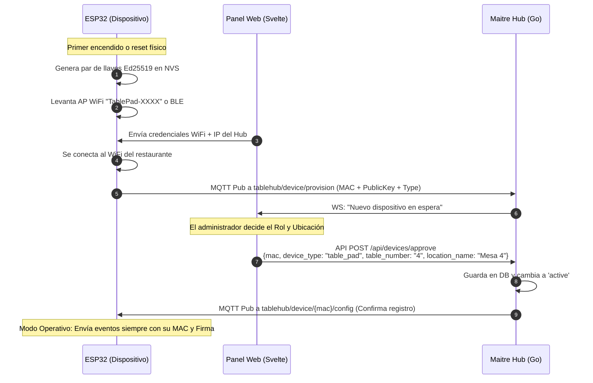

# Arquitectura de Dispositivos y Seguridad (Tablehub)

Este documento detalla la planificación del dominio de dispositivos genéricos (TablePads y otros periféricos basados en ESP32/IoT), la topología de comunicación (Wi-Fi, Zigbee) y el diseño de la seguridad para proteger las interacciones locales entre el hardware y el Maitre Hub, manteniendo el sistema modular y desacoplado de las mesas físicas.

---

## 1. Conectividad: Wi-Fi vs. Zigbee vs. ESP-NOW

Para la comunicación de los dispositivos distribuidos en el restaurante con el Hub local, se analizan tres tecnologías principales:

| Característica | Wi-Fi (MQTT) | Zigbee | ESP-NOW |
| :--- | :--- | :--- | :--- |
| **Hardware del Hub** | Cualquier PC/Raspberry Pi (No requiere radios extras). | Requiere Gateway/Coordinador Zigbee (ej. Dongle USB). | Requiere un ESP32 "Puente" conectado al Hub por USB/Serial. |
| **Hardware del Dispositivo** | ESP32 Clásico, ESP32-S3, ESP32-C3. | Requiere chips específicos con radio 802.15.4 (ej. ESP32-C6). | Cualquier chip de la familia ESP32 (Clásico, S3, C3, C6). |
| **Consumo de Batería** | Medio (requiere Deep Sleep optimizado). | Muy Bajo (diseñado para batería). | Bajo (transmisiones de muy corto tiempo). |
| **Complejidad de Software** | Baja (MQTT estándar sobre IP). | Alta (Middleware Zigbee2MQTT, perfiles Zigbee). | Media (Enrutamiento custom a nivel de MAC). |
| **Escalabilidad local** | Depende del router Wi-Fi del restaurante. | Alta (Estructura de red mesh auto-regenerativa). | Alta (Directo de dispositivo a dispositivo). |

### Decisión Tecnológica Recomendada
1. **Fase Inicial (Wi-Fi + MQTT Local):** 
   - Se utilizará **Wi-Fi** con protocolo **MQTT** apuntando al servidor NATS embebido del Hub (Puerto 1883) que ya fue diseñado en el Hito 3. 
   - **Razón:** No impone costes de hardware adicionales en el Hub (no requiere comprar gateways Zigbee USB) ni limita la elección del módulo ESP32 básico. Además, se integra directamente con la infraestructura de eventos de NATS JetStream en Go que ya está en marcha.
2. **Evolución Futura (Zigbee):**
   - El sistema se diseñará de forma desacoplada para que en el futuro se pueda incorporar un coordinador Zigbee en el Hub y usar chips **ESP32-C6** en el hardware sin cambiar la lógica de negocio del Hub, ya que Zigbee2MQTT traducirá los mensajes Zigbee a tópicos MQTT idénticos en el servidor NATS.

---

## 2. Planificación de la Seguridad: ¿Qué nos conviene usar?

La seguridad en redes locales de restaurantes es un desafío crítico: clientes maliciosos en la red Wi-Fi local del restaurante podrían interceptar el tráfico MQTT o forjar peticiones para simular llamadas al mesero falsas o realizar pedidos no autorizados.

Se evalúan tres alternativas de seguridad para proteger las publicaciones de los dispositivos:

### Opción A: Seguridad a Nivel de Transporte (TLS/MQTTS)
- **Concepto:** Cifrar todo el canal TCP utilizando TLS 1.2 o 1.3 con certificados.
- **Ventajas:** Cifra todo el tráfico, evita el sniffing de datos en tránsito.
- **Desventajas:** La negociación TLS (handshake) consume mucha CPU y memoria RAM en el ESP32, lo que incrementa el tiempo de conexión activa y reduce drásticamente la duración de la batería (pasa de <100ms a más de 2 segundos de tiempo encendido por transmisión).

### Opción B: Tokens Simétricos Únicos (Pre-Shared Key por MAC)
- **Concepto:** Cada dispositivo recibe un token secreto (ej. 32 bytes) generado por el Hub en el aprovisionamiento. El ESP32 envía este token en el payload o como contraseña de la conexión MQTT.
- **Ventajas:** Muy rápido de verificar y calcular.
- **Desventajas:** Si un atacante tiene acceso físico al hardware de una mesa, puede extraer la memoria flash (NVS) del ESP32 mediante puerto serie y obtener la clave secreta compartida, lo que le permitiría clonar el dispositivo.

### Opción C: Criptografía Asimétrica (Ed25519) - *Recomendada*
- **Concepto:** Cada ESP32 genera su propio par de llaves asimétricas (Pública/Privada) en su primer arranque. Durante el aprovisionamiento, transmite la **Clave Pública** al Hub. Al enviar eventos críticos (como una alerta), firma digitalmente el payload JSON con su **Clave Privada**. El Hub valida la firma usando la clave pública registrada para esa MAC.
- **Ventajas:**
  - **Zero Trust Local:** La clave privada nunca viaja por la red ni se expone al Hub.
  - **Eficiencia Extrema:** La curva elíptica Ed25519 es sumamente ligera. Firmar un payload en un ESP32 toma unos pocos milisegundos y requiere muy poca memoria, lo que es ideal para dispositivos alimentados por batería que despiertan de Deep Sleep.
  - **No requiere TLS:** Al firmar los payloads de forma individual, no dependemos del cifrado de canal TLS para evitar la falsificación o manipulación de datos (tampering), reduciendo los tiempos de conexión y el consumo de energía.
  - **Alineación con el Core:** El Hub ya utiliza criptografía Ed25519 para su autenticación de túnel hacia la nube (en `hub/internal/crypto/ed25519.go`), por lo que reutilizamos el motor criptográfico en Go.

### 2.4. Estrategia de Hardware por Niveles: "Lite" vs. "Pro"

Para adaptarnos a las necesidades y presupuestos de diferentes tipos de restaurantes, el sistema se estructurará para soportar dos tiers de dispositivos cliente en las mesas:

#### 1. Nivel "Lite" (Microcontroladores - ESP32)
* **Hardware:** Botones físicos de llamada (Llamar Mesero, Pedir Cuenta, Ayuda/Cancelar) o teclados numéricos básicos con pantallas de bajo consumo (LCD o Tinta Electrónica).
* **Conectividad:** Wi-Fi o Zigbee (MQTT con payload firmado).
* **Alimentación:** Batería tradicional o recargable con autonomía extendida de meses/años (gracias al modo *Deep Sleep*).
* **Lógica:** Lógica fija basada en eventos sencillos. No requiere menús dinámicos ni carga de imágenes.
* **Seguridad:** Firmas criptográficas Ed25519 sobre canales sin cifrar en la red dedicada del local.

#### 2. Nivel "Pro" (Procesadores ARM64 - Linux / Android)
* **Hardware:** Tablets Android o pantallas táctiles empotradas (ej. Raspberry Pi en modo Kiosco).
* **Conectividad:** Wi-Fi (HTTPS / WebSockets seguros sobre TLS completos).
* **Alimentación:** Alimentación constante por cableado oculto en la mesa o estaciones de carga.
* **Lógica:** Aplicación interactiva enriquecida. Presentación web interactiva (desarrollada en Svelte/Vite) que muestra la carta digital con fotos, descripciones, llamadas al mesero avanzadas, carro de compras integrado y pagos con QR.
* **Seguridad:** Cifrado completo HTTPS y WSS de extremo a extremo, políticas de Kiosco para bloquear la interfaz de Android/Linux, y actualizaciones de seguridad del SO nativas.

---

## 3. Arquitectura del Dominio de Dispositivos (Modular y Desacoplado)

Para evitar bloquear el sistema y permitir que el hardware se use para otros fines (no solo mesas físicas, sino también cocina, sensores, avisadores generales, etc.), diseñamos el dominio con un enfoque **genérico y extensible**. 

### 3.1. Modelo de Datos (Base de Datos SQLite)
El dispositivo es la entidad principal. La asociación a una "mesa" es opcional. Agregamos un rol/tipo de dispositivo y una ubicación amigable:

```sql
CREATE TABLE IF NOT EXISTS devices (
    mac_address TEXT PRIMARY KEY,
    device_type TEXT NOT NULL DEFAULT 'table_pad',  -- 'table_pad' | 'kitchen_button' | 'sensor' | 'generic'
    table_number TEXT,                              -- Opcional (NULL si no está asignado a una mesa)
    location_name TEXT,                             -- Ubicación física amigable (ej: "Barra", "Mesa 4", "Cocina", "Almacén")
    ip_address TEXT NOT NULL,
    public_key TEXT,                                -- Clave pública Ed25519 del dispositivo (hex)
    battery_level INTEGER DEFAULT 100,
    wifi_signal INTEGER DEFAULT 0,
    status TEXT DEFAULT 'unprovisioned',           -- 'unprovisioned' | 'active' | 'blocked'
    last_seen TIMESTAMP DEFAULT CURRENT_TIMESTAMP,
    created_at TIMESTAMP DEFAULT CURRENT_TIMESTAMP
);
```

### 3.2. Estructura de Tópicos MQTT e Invariabilidad del Firmware

Para evitar que el firmware del ESP32 tenga que saber dónde está ubicado o a qué mesa pertenece (lo que obligaría a re-configurarlo si se cambia de mesa física), el firmware **solo conoce su propia identidad (MAC)**. 

El Hub realiza el mapeo de la MAC a su ubicación/mesa dinámicamente en base de datos.

1. **Aprovisionamiento (Broadcast / Registro inicial):**
   - Tópico: `tablehub/device/provision`
   - Dirección: Dispositivo ➡️ Hub
   - Payload: `{"mac": "AA:BB:CC:DD:EE:FF", "public_key": "hex_public_key", "ip": "192.168.1.150", "type": "table_pad"}`
   
2. **Estado y Telemetría del Dispositivo:**
   - Tópico: `tablehub/device/{mac}/status` (Mapeado en NATS a `tablehub.device.{mac}.status`)
   - Dirección: Dispositivo ➡️ Hub
   - Payload firmado:
     ```json
     {
       "payload": {
         "mac": "AA:BB:CC:DD:EE:FF",
         "battery": 87,
         "wifi": -65,
         "status": "active",
         "timestamp": 1789999990
       },
       "signature": "hex_signature_of_payload"
     }
     ```

3. **Eventos y Alertas del Dispositivo:**
   - Tópico: `tablehub/device/{mac}/event` (Mapeado en NATS a `tablehub.device.{mac}.event`)
   - Dirección: Dispositivo ➡️ Hub
   - Payload firmado:
     ```json
     {
       "payload": {
         "mac": "AA:BB:CC:DD:EE:FF",
         "event_type": "alert",  -- "alert" | "button_press" | "telemetry"
         "kind": "waiter",       -- "waiter" (mesero) | "bill" (cuenta) | "help" | "ready" (cocina lista), etc.
         "timestamp": 1789999995
       },
       "signature": "hex_signature_of_payload"
     }
     ```

4. **Comandos de Control:**
   - Tópico: `tablehub/device/{mac}/command`
   - Dirección: Hub ➡️ Dispositivo
   - Payload: comandos JSON (ej. cambiar color de LEDs, reiniciar, actualización OTA).

---

## 4. Flujo de Aprovisionamiento y Mapeo Dinámico

El flujo de trabajo permite reasignar la función de un dispositivo al instante sin tocar el hardware:



### Flexibilidad de Asignación en la UI
Desde la interfaz web de Tablehub, el administrador puede:
- Configurar un dispositivo como **Mesa (TablePad)**: asociándolo a un `table_number` específico.
- Configurar un dispositivo como **Avisador de Cocina**: dejando `table_number = NULL` y asignando `location_name = "Cocina"` y `device_type = "kitchen_button"`.
- Cambiar la ubicación/mesa de un dispositivo al instante. El firmware no requiere enterarse del cambio, ya que el Hub asocia los eventos de esa MAC al nuevo destino de forma lógica.

---

## 5. Validación y Enrutamiento de Eventos en Go (NATS JetStream)

Cuando el consumidor de NATS JetStream recibe un evento en `tablehub.device.*.event`:

1. **Extracción y Validación:**
   - Lee el payload y extrae la dirección MAC y la firma.
   - Busca en SQLite el registro del dispositivo mediante la MAC.
   - Valida la firma Ed25519 con la clave pública almacenada y verifica la ventana de tiempo (`timestamp`).
   
2. **Resolución de Contexto:**
   - El Hub obtiene el tipo de dispositivo (`device_type`), el número de mesa (`table_number`) y la ubicación física (`location_name`) configurados en SQLite.
   
3. **Propagación Lógica:**
   - Si es un `table_pad` asociado a la mesa 4, el Hub mapea el evento internamente a un evento de mesa tradicional y lo reenvía a los meseros como una alerta de mesa.
   - Si es un botón de cocina, procesa la alerta como "Platos listos para recoger en barra" y lo notifica a los meseros.
   - Si no está asociado a nada específico, guarda el log de telemetría sin disparar alertas de servicio.
