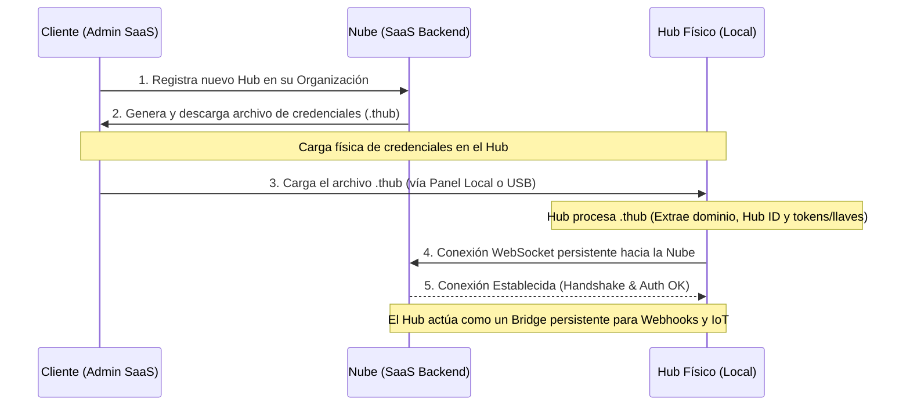

# Diseño de Vinculación de Hub (Mediante Llaves .thub)

Este documento describe la arquitectura de vinculación y comunicación entre el Hub físico (localizado en la tienda del cliente) y la Nube (SaaS), utilizando archivos de configuración/llaves `.thub`.

## Flujo de Vinculación y Autenticación (.thub)

Para evitar flujos complejos de sincronización interactiva o el uso de códigos de vinculación (pairing codes) manuales, el sistema utiliza un archivo de credenciales descargable (`.thub`) generado por el panel del SaaS.

El flujo de aprovisionamiento es el siguiente:

## Estructura del Archivo `.thub`
El archivo `.thub` utiliza un formato estructurado (JSON firmado/cifrado) y contiene la configuración inicial necesaria para que el Hub encuentre la Nube y se autentique de forma segura:
- `version`: Versión del esquema del archivo (para retrocompatibilidad).
- `cloud_domain`: URL base de la nube principal a la que debe apuntar.
- `fallback_domains`: Lista de dominios de respaldo en caso de migración o caída del principal.
- `hub_id`: Identificador único asignado al dispositivo en la nube.
- `bootstrap_token`: Token temporal de un solo uso para el primer handshake y la negociación de claves.
- `org_id`: Identificador de la organización dueña del Hub.
- `signature`: Firma criptográfica del SaaS para validar la integridad del archivo.

## Consideraciones de Seguridad y Aprovisionamiento Único
Para proteger la integridad del Hub y de la red de la tienda, se aplican los siguientes mecanismos y justificaciones de diseño:

### 1. Importancia del Aprovisionamiento de Uso Único (Bootstrap Token)
El uso de un `bootstrap_token` temporal y de **un solo uso** es fundamental por dos razones críticas:

*   **Evitar Conflictos de Conexión (Connection Flapping):** 
    En el backend de la nube, la clase [HubRegistry](file:///home/kaber420/Documentos/proyectos/tablehub2/cloud/internal/interfaces/ws/hub_registry.go#L27) (específicamente la función [Store](file:///home/kaber420/Documentos/proyectos/tablehub2/cloud/internal/interfaces/ws/hub_registry.go#L54)) fuerza una única sesión WebSocket activa por cada `hub_id` para evitar duplicados. Si un archivo `.thub` contiene credenciales estáticas reutilizables y se instala en dos dispositivos diferentes por error, ambos entrarán en un **bucle infinito de desconexiones mutuas** (flapping) al intentar reconectarse automáticamente, tirando el servicio de ambos hubs.
*   **Mitigar la Clonación de Identidad:** 
    Si el archivo `.thub` se guarda o transmite (por ejemplo, en el ordenador del administrador o en un pendrive USB), cualquier persona con acceso al archivo podría extraer las credenciales finales e impersonar al Hub legítimo, interceptando pedidos y enviando telemetría falsa. Al usar un `bootstrap_token` de un solo uso, el archivo queda completamente inútil inmediatamente después del primer enlace exitoso.

### 2. Generación Local de Llaves (Key Agreement Model)
En lugar de un modelo de "Key Delivery" (donde la nube genera y expone la clave privada en el `.thub`), el sistema transiciona a un modelo de "Key Agreement":
*   El archivo `.thub` solo contiene el `hub_id`, la dirección de la nube y el `bootstrap_token` temporal.
*   El Hub físico, en su primera ejecución o al recibir el archivo, genera de forma local y autónoma un par de claves Ed25519 usando hardware/entropía local. La clave privada **nunca** se transmite por la red ni sale del almacenamiento seguro del Hub.
*   Durante el handshake de inicialización, el Hub envía su **clave pública** a la nube junto con el `bootstrap_token`.
*   La nube registra la clave pública asociada a ese `hub_id` y destruye/quema el `bootstrap_token` en la base de datos.
*   A partir de ese momento, la autenticación se realiza mediante reto-respuesta criptográfico con Ed25519 (ver [AuthenticateHub](file:///home/kaber420/Documentos/proyectos/tablehub2/cloud/internal/interfaces/ws/auth.go#L43)).

### 3. Revocación e Integridad
*   **Revocación Inmediata:** El administrador puede desvincular un Hub desde el panel del SaaS, lo que elimina la clave pública en la base de datos de la nube, impidiendo instantáneamente futuros handshakes WebSocket.
*   **Verificación TLS Estándar:** El cliente WebSocket del Hub realiza una validación estándar y estricta de los certificados TLS del servidor SaaS utilizando las CAs del sistema operativo para evitar interceptaciones MitM sin introducir la complejidad ni el riesgo de desconexión por la rotación periódica de certificados de la nube.

## Robustez y Casos de Borde
- **Dominios de Respaldo (Fallback Domains)**: Si el dominio principal no responde, el Hub intenta conectarse a los dominios listados en `fallback_domains` aplicando exponencial backoff con jitter.
- **Unicidad de Conexión (Anti-Clonación)**: La Nube permite una sola conexión WebSocket activa por cada `hub_id`. Si otro dispositivo intenta conectarse con las mismas credenciales, se bloquea la sesión anterior o se genera una alerta de duplicidad.
- **Compatibilidad de Versiones**: El Hub debe ignorar campos adicionales no reconocidos en el JSON del `.thub` si la versión del esquema cambia en el futuro.
- **Validación del Archivo**: Para evitar estados inconsistentes por archivos corruptos, el Hub realiza un parseo y validación de firma completo en memoria antes de guardar y aplicar los cambios localmente.

## Operación como Bridge de Eventos (Nube ➔ Dispositivos IoT)
Como el Hub se encuentra detrás de una red local o casera sin exposición a internet ni puertos abiertos:
1. **Conexión Outbound**: El Hub inicia la conexión saliente por WebSocket al dominio configurado en el archivo `.thub`.
2. **Canal Persistente**: Mantiene el canal abierto mediante heartbeats (ping/pong) periódicos.
3. **Distribución Local**: Cuando el POS en la nube genera una orden, el SaaS la envía de forma asíncrona por el túnel/WebSocket de ese Hub. El Hub recibe la orden localmente y la retransmite en la red interna a los dispositivos IoT (pantallas de estado de orden).

## Roadmap de Implementación (Cloud vs. Hub)

Para llevar a cabo este diseño, dividimos las tareas en fases incrementales de desarrollo, separando el trabajo que se debe realizar en la Nube (SaaS Cloud) y en el software del Hub Físico.

---

### Fase 1: Aprovisionamiento y Generación de Credenciales (`.thub`)

Esta fase se centra en la creación, descarga e importación inicial del archivo de vinculación, asegurando la correcta asignación del Hub a una Sucursal (Branch).

#### ☁️ Tareas Cloud (Nube)
- **Mapeo del Modelo en Go:**
  * Modificar el struct `Hub` en [hub.go](file:///home/kaber420/Documentos/proyectos/tablehub2/cloud/internal/domain/hub/hub.go) para incluir la relación con la sucursal: `BranchID *uuid.UUID` (o un alias equivalente como `types.BranchID`).
  * Actualizar las consultas SQL en [hub_repo.go](file:///home/kaber420/Documentos/proyectos/tablehub2/cloud/internal/infrastructure/db/hub_repo.go) para guardar (`INSERT`) y leer (`SELECT`) la columna `branch_id` existente en PostgreSQL.
- **Generación de Llaves de Firma de la Nube:** Crear y almacenar un par de claves para la firma digital de los archivos `.thub`.
- **Endpoint de Registro & Descarga:** 
  * Implementar el endpoint `POST /v1/orgs/{org_id}/hubs` que reciba el `branch_id` en el cuerpo del request.
  * Generar un `bootstrap_token` de uso único (con expiración corta), asociarlo al Hub creado, y firmar digitalmente el JSON para generar el archivo `.thub`.
- **UI de Panel SaaS (Dashboard de Clientes):**
  * En la vista de registro del Hub, agregar un menú desplegable (Select) con las sucursales creadas en la organización para que el usuario asocie obligatoriamente el Hub a un local físico (`branch_id`).
  * Enviar el `branch_id` seleccionado en la llamada al endpoint de registro.

#### 🔌 Tareas Hub (Físico)
- **Interfaz de Carga Local:** Desarrollar el formulario en el panel web local del Hub (Svelte) para subir el archivo `.thub`.
- **Lector USB (Opcional/Auto-deploy):** Crear un script/daemon en segundo plano que detecte dispositivos USB conectados, busque un archivo `.thub` válido y lo cargue automáticamente.
- **Validación del Archivo:** Implementar la lógica para parsear el archivo `.thub`, verificar la firma criptográfica con la clave pública preinstalada de la Nube, y guardar la configuración básica (`cloud_domain`, `hub_id`, `bootstrap_token`) en la tabla de configuraciones clave-valor (`settings`) en la base de datos local SQLite del Hub.

---

### Fase 2: Registro Inicial y Conexión Criptográfica (Handshake & Auth)

Esta fase implementa la generación local de llaves y el primer intercambio seguro para registrar el Hub en la nube.

#### ☁️ Tareas Cloud (Nube)
- **Endpoint de Handshake Inicial (WebSocket/HTTP):** Implementar la lógica para recibir la clave pública Ed25519 del Hub y el `bootstrap_token`.
- **Validación y Quemado de Token:** Validar que el token sea correcto, guardar la clave pública Ed25519 asociada al `hub_id`, y destruir inmediatamente el `bootstrap_token` en base de datos.
- **Servicio de Desafío-Respuesta (Challenge-Response):** Implementar en [auth.go](file:///home/kaber420/Documentos/proyectos/tablehub2/cloud/internal/interfaces/ws/auth.go) la generación y validación de retos criptográficos aleatorios firmados por el Hub con Ed25519 para iniciar conexiones de WebSocket subsecuentes.
- **Garantizar Sesión Única:** Refinar [HubRegistry](file:///home/kaber420/Documentos/proyectos/tablehub2/cloud/internal/interfaces/ws/hub_registry.go) para forzar la desconexión inmediata de cualquier cliente anterior si se establece una nueva sesión legítima con el mismo `hub_id` (evitando bucles de reconexión infinita o flapping).

#### 🔌 Tareas Hub (Físico)
- **Generador de Par de Llaves:** Al recibir un `.thub` válido por primera vez, generar un par de claves Ed25519 localmente de forma segura. Guardar la clave privada localmente sin exponerla y la clave pública para el registro.
- **Handshake Inicial:** Realizar la petición de registro inicial enviando la clave pública y el `bootstrap_token` a la Nube.
- **Cliente WebSocket Persistente:** Desarrollar el cliente WebSocket resiliente para conectarse al `cloud_domain` (y fallbacks en caso de error) usando exponencial backoff con jitter.
- **Firma del Desafío:** Implementar la resolución de retos (firmar el string/payload enviado por la Nube con la clave privada local Ed25519) en el handshake del WebSocket.

---

### Fase 3: Bridge de Eventos en Operación (Nube ➔ Dispositivos IoT)

Esta fase habilita la comunicación real y el enrutamiento de webhooks/órdenes del POS a los locales físicos.

#### ☁️ Tareas Cloud (Nube)
- **Ruteador de Mensajes por Sucursal:**
  * Implementar el intermediario que reciba los eventos transaccionales del POS (comandas, llamados de mesas) asociados a una sucursal (`branch_id`).
  * Buscar el Hub activo conectado que tenga asignada esa `branch_id` en la tabla `hub_registry` y enrutar el mensaje a través de su conexión WebSocket.
- **Endpoint de Revocación de Hub:** Crear la funcionalidad de "Desvincular Hub" en la Nube que elimine la clave pública del Hub, invalidando instantáneamente cualquier conexión activa y futuros handshakes.

#### 🔌 Tareas Hub (Físico)
- **Gestor de Mensajes Entrantes:** Implementar el dispatcher local de mensajes que escuche la conexión WebSocket del Cloud, valide los datos recibidos y determine a qué dispositivo local retransmitir.
- **Bridge de Red Local (IoT):** Desarrollar la lógica de envío local a dispositivos IoT de mesa (vía red local Wi-Fi, mDNS o protocolos dedicados como HTTP/REST local).

