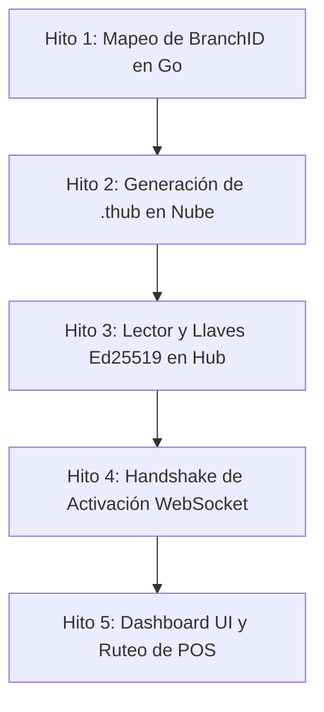

# Roadmap de Implementación: Vinculación de Hubs (.thub)

Este documento detalla la estrategia y los hitos incrementales para implementar el flujo de vinculación de Hubs físicos con Tablehub Cloud utilizando archivos de credenciales `.thub` firmados. 

El desarrollo se divide en **5 hitos independientes y verificables** para mitigar riesgos y asegurar la compatibilidad con el entorno de desarrollo actual.

---

## Estructura de Entidades y Relación de Negocio

Para que la Nube pueda enrutar los eventos del POS (comandas, llamados de mesa) al dispositivo físico correcto, cada Hub se mapea de la siguiente manera:

1. **Organización (SaaS Client):** Ej. "Pizzería Don Tomás" (facturación y límites de cuenta).
2. **Sucursal (Branch):** Ej. "Sucursal Centro". Cada sucursal física representa una ubicación independiente del restaurante y contiene sus propias mesas y su propio POS.
3. **Hub (Bridge local):** Dispositivo físico instalado en la sucursal. Enruta mensajes entre la Nube y los periféricos de mesa (IoT). Cada Hub debe pertenecer a una sucursal (`branch_id`) para saber a dónde dirigir sus comandas.

---

## Hitos de Desarrollo

### Hito 1: Mapeo de `branch_id` en la Nube
* **Objetivo:** Que el backend de Go entienda y persista la relación del Hub con su Sucursal física.
* **Tareas Cloud (Nube):**
  * Modificar el struct `Hub` en [hub.go](file:///home/kaber420/Documentos/proyectos/tablehub2/cloud/internal/domain/hub/hub.go) para incluir la relación con la sucursal: `BranchID *uuid.UUID` (o un alias equivalente como `types.BranchID`).
  * Actualizar las consultas SQL del repositorio en [hub_repo.go](file:///home/kaber420/Documentos/proyectos/tablehub2/cloud/internal/infrastructure/db/hub_repo.go) para persistir (`INSERT`) y leer (`SELECT`) la columna `branch_id` de la tabla `hub_registry` en PostgreSQL.
* **Verificación:** Extender y correr las pruebas del repositorio de base de datos (`go test -v ./cloud/internal/infrastructure/db/...`).

---

### Hito 2: Generación de Credenciales `.thub` sin llaves privadas (API Cloud)
* **Objetivo:** Crear un endpoint seguro en el SaaS que genere un token temporal de uso único (bootstrap token) y cree el archivo de configuración `.thub` firmado digitalmente por la Nube, sin incluir ninguna clave privada del Hub.
* **Tareas Cloud (Nube):**
  * Crear la estructura del archivo `.thub` (JSON conteniendo `cloud_domain`, `hub_id`, `org_id`, `bootstrap_token` temporal y firma digital de la Nube).
  * **Principio de Seguridad:** El archivo `.thub` NO contendrá en ningún caso llaves privadas. La clave privada se generará de manera exclusiva en el Hub físico (Hito 3) y nunca saldrá de él.
  * Implementar el endpoint `POST /v1/orgs/{org_id}/hubs` que reciba `branch_id` y `hub_id`, registre el Hub en base de datos con un token temporal de uso único (`bootstrap_token`) y genere el archivo JSON firmado con la clave privada de la Nube.
* **Verificación:** Realizar peticiones HTTP manuales (vía `curl` o REST client) al endpoint y verificar que el archivo `.thub` retornado tenga la estructura correcta (con `bootstrap_token`) y no contenga campos de claves privadas.

---

### Hito 3: Generación Autónoma de Llaves (Hub Físico)
* **Objetivo:** Permitir que el Hub local lea el archivo `.thub` de configuración y genere de forma local y autónoma su propio par de claves Ed25519, garantizando que la clave privada nunca se transmita.
* **Tareas Hub (Físico):**
  * Crear un endpoint local o formulario en el panel local del Hub (Svelte) para subir el archivo `.thub`.
  * Validar la firma digital del archivo utilizando la clave pública preinstalada de la Nube para certificar que proviene del SaaS oficial.
  * **Generación Local:** Generar de forma autónoma un par de claves Ed25519 (Pública/Privada) si no existen.
  * **Almacenamiento Seguro:** Guardar la clave privada localmente de forma segura (ej. en `data/hub_cloud.key` con permisos `0600`) garantizando que NUNCA salga del dispositivo físico.
  * Almacenar el `hub_id`, la clave pública generada, el `bootstrap_token` y el dominio de la nube en la tabla `settings` de SQLite.
* **Verificación:** Cargar un `.thub` de prueba en el panel local del Hub de desarrollo y verificar que se genere la llave privada local de forma segura, y que los parámetros del `.thub` se guarden en SQLite.

---

### Hito 4: Handshake de Activación y Registro de Clave Pública (Handshake & WebSocket)
* **Objetivo:** Intercambiar de forma segura la clave pública del Hub físico utilizando el token de un solo uso, registrándola en la Nube y eliminando el token de aprovisionamiento.
* **Tareas Cloud (Nube):**
  * Crear el endpoint de activación/registro que reciba `hub_id`, `bootstrap_token` y la **clave pública** Ed25519 generada por el Hub físico.
  * Validar el `bootstrap_token`. Si es correcto:
    * Registrar la clave pública del Hub en la base de datos de la Nube para asociarla a ese `hub_id`.
    * Destruir inmediatamente el `bootstrap_token` de la base de datos para evitar cualquier re-uso.
  * Adaptar el flujo de WebSocket en [auth.go](file:///home/kaber420/Documentos/proyectos/tablehub2/cloud/internal/interfaces/ws/auth.go) para autenticar las conexiones posteriores usando un reto criptográfico (challenge-response) firmado por la clave privada Ed25519 local del Hub.
* **Tareas Hub (Físico):**
  * Al iniciar la primera conexión hacia la Nube, enviar la clave pública y el `bootstrap_token` temporal para activar el dispositivo.
  * En conexiones WebSocket posteriores, responder a los desafíos criptográficos enviados por la Nube firmándolos con la clave privada Ed25519 local.
* **Verificación:** Iniciar el Hub local y comprobar en la Nube que el token se destruye al recibir la clave pública, y que los handshakes posteriores se autentican correctamente mediante Ed25519 sin usar tokens.

---

### Hito 5: Panel UI de SaaS y Enrutamiento por Sucursal
* **Objetivo:** Completar la experiencia del usuario y enrutar las transacciones del POS al local físico correcto de forma automática.
* **Tareas Cloud (Nube):**
  * Modificar el enrutador de mensajes para buscar el Hub activo en base al `branch_id` del evento del POS y enviar la comanda por su respectivo WebSocket.
  * Agregar el dropdown de sucursales en el modal de registro de Hubs dentro del panel de Svelte.
* **Verificación:** Simular un webhook del POS de una sucursal específica y corroborar que la comanda llegue exclusivamente al Hub físico asignado a esa sucursal.
