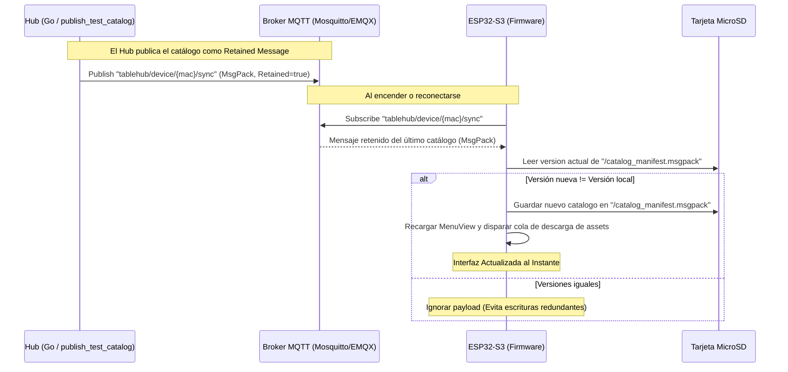

# Plan de Sincronización Automática y Migración a MessagePack

Este documento especifica el diseño y la implementación para migrar la sincronización del catálogo desde JSON a MessagePack binario, e implementar control de versiones automático utilizando mensajes retenidos en MQTT para evitar discrepancias de precios o menús desactualizados.

---

## 1. Arquitectura de Sincronización



---

## 2. Especificación en Go (Hub / Scripts)

Se integrará la biblioteca oficial de MessagePack (`github.com/vmihailenco/msgpack/v5`) en el entorno Go para realizar la serialización binaria antes de publicar.

### Cambios en dependencias (`go.mod`)
```go
require (
    github.com/vmihailenco/msgpack/v5 v5.4.1
)
```

### Cambios en publicador (`publish_test_catalog.go`)
- Reemplazar codificación JSON por MessagePack:
  ```go
  import "github.com/vmihailenco/msgpack/v5"
  
  // ...
  data, err := msgpack.Marshal(payload)
  ```
- Publicar en MQTT configurando la bandera de retención en `true` para asegurar que el broker guarde el último estado para pantallas recién conectadas:
  ```go
  token := client.Publish(topic, 0, true, data) // retained = true
  ```

---

## 3. Especificación en Firmware (ESP32-S3)

### Almacenamiento en MicroSD
- El archivo manifest del catálogo cambia de extensión a `/catalog_manifest.msgpack`.
- Al recibir una sincronización por MQTT, el payload binario se escribe directamente sin conversión.

### Lógica de Sincronización (`MQTTService.cpp`)
```cpp
void MQTTService::processSync(byte* payload, unsigned int length) {
    JsonDocument doc;
    DeserializationError error = deserializeMsgPack(doc, payload, length);
    if (error) {
        Serial.println("[SYNC] Error parseando MsgPack recibido");
        return;
    }

    String newVersion = doc["catalog_version"].as<String>();
    String currentVersion = "";

    // Leer versión actual desde la MicroSD
    File file = SD.open("/catalog_manifest.msgpack", FILE_READ);
    if (file) {
        JsonDocument localDoc;
        if (!deserializeMsgPack(localDoc, file)) {
            currentVersion = localDoc["catalog_version"].as<String>();
        }
        file.close();
    }

    // Comparación de versión
    if (newVersion == currentVersion && newVersion.length() > 0) {
        Serial.println("[SYNC] Catalogo ya actualizado (" + newVersion + "). Ignorando.");
        return;
    }

    Serial.println("[SYNC] Nueva version de catalogo: " + newVersion);

    // Guardar nuevo binario MsgPack
    File outFile = SD.open("/catalog_manifest.msgpack", FILE_WRITE);
    if (outFile) {
        outFile.write(payload, length);
        outFile.close();
        Serial.println("[SYNC] Manifesto MsgPack guardado.");
    }
    
    // Disparar sincronización de assets (imágenes)...
}
```

### Carga del Catálogo (`MenuView.cpp`)
```cpp
void MenuView::loadDataFromSD() {
    if (!categories.empty()) return;
    categories = { {0, "Todos", "LV_SYMBOL_LIST", LV_SYMBOL_LIST} };

#ifdef ARDUINO
    File file = SD.open("/catalog_manifest.msgpack");
    if (file) {
        JsonDocument doc;
        DeserializationError error = deserializeMsgPack(doc, file);
        if (!error) {
            // Cargar categorías e ítems desde MsgPack
            // ...
        } else {
            Serial.println("[MENU] Error leyendo manifest de MicroSD");
        }
        file.close();
    }
#endif
}
```

---

## 4. Beneficios del Diseño

1. **Actualizaciones sin errores:** El cliente siempre verá los precios vigentes porque las pantallas obtienen el catálogo de inmediato al conectarse o encenderse.
2. **Cero lag de parseo:** MessagePack reduce a una fracción el procesamiento en el ESP32, agilizando el arranque del dispositivo.
3. **Escrituras seguras:** Al comparar versiones antes de guardar, evitamos escrituras innecesarias en la memoria Flash/SD, prolongando su vida útil.
