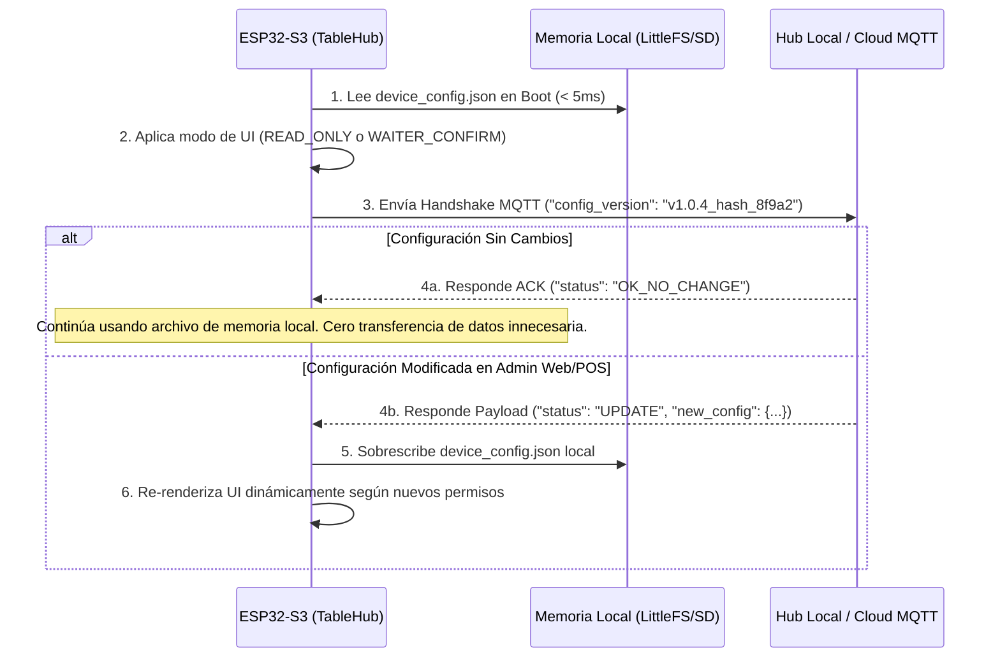

# Diseño Arquitectónico: Carrito de Compras, Permisos Dinámicos y Persistencia en Memoria Local (ESP32-S3)

Documento de especificación técnica y flujo operativo para la gestión del **Carrito de Pedidos**, **Permisos de Operación (Solo Lectura vs. Pedidos)** y **Persistencia Local de Configuración con Caché de Versión (Zero-Data Waste)** en el dispositivo TableHub ESP32-S3.

---

## 1. Modos de Operación y Permisos de Pedido

Para adaptarse a distintos tipos de restaurantes o zonas del establecimiento (ej. VIP, Bar, Terraza, Menú Informativo), el ESP32-S3 soportará tres modos de operación principales:

| Modo de Operación | Código Config | Comportamiento en UI (LVGL) | Flujo de Pedido |
| :--- | :--- | :--- | :--- |
| **Solo Lectura** | `READ_ONLY` | Oculta el carrito `🛒` y solo permite explorar platillos y modales informativos. | No se pueden armar pedidos. |
| **Confirmación por Mesero** | `WAITER_CONFIRM` | Muestra el carrito `🛒`. El botón final es **"Enviar a Mesero"**. | Notifica a la comandera/tablet del mesero (`Mesa 4 solicita confirmación`). El mesero valida en mesa y aprueba el pase a cocina. |
| **Directo a Cocina** | `DIRECT_KITCHEN` | Muestra el carrito `🛒`. El botón final es **"Enviar a Cocina"**. | Envía la comanda inmediatamente al KDS / Impresora de cocina vía MQTT / Hub. |

---

## 2. Persistencia en Memoria Local y Ahorro de Datos (Offline-First Config)

Para garantizar un encendido instantáneo, cero latencia de red y un consumo mínimo de datos Wi-Fi/MQTT, la configuración de permisos y versión del menú se manejará en almacenamiento local (**LittleFS / SPIFFS / MicroSD**).

### A. Estructura del Archivo de Configuración Local (`/sd/config/device_config.json`)

```json
{
  "config_version": "v1.0.4_hash_8f9a2",
  "device_uuid": "550e8400-e29b-41d4-a716-446655440000",
  "table_number": 4,
  "permissions": {
    "allow_ordering": true,
    "mode": "WAITER_CONFIRM",
    "require_waiter_pin": false
  },
  "cart_settings": {
    "max_items": 20,
    "currency_symbol": "$"
  }
}
```

### B. Ciclo de Vida y Protocolo de Sincronización Eficiente



---

## 3. Arquitectura del Carrito en Firmware (`CartManager` C++)

### A. Modelo de Datos (`CartManager.h`)
Un gestor Singleton en C++ que mantiene en memoria RAM el carrito actual de la mesa:

- `struct CartItem`: `itemId`, `name`, `price`, `quantity`, `notes`.
- `addItem(int itemId)`: Incrementa cantidad o añade platillo.
- `removeItem(int itemId)`: Decrementa o elimina.
- `getTotalPrice()`: Calcula el costo acumulado instantáneamente.
- `getItemCount()`: Retorna el total de unidades para la insignia badge `🛒 (N)`.
- `clearCart()`: Vacía el pedido tras ser enviado con éxito.

### B. Integración Visual en LVGL

1. **Insignia Flotante en HeaderBar:**
   - Si `getItemCount() > 0`, muestra el ícono `🛒` resaltado con el número de artículos.
   - Al presionar `🛒`, abre el modal **"Mi Pedido (Mesa X)"**.

2. **Modal del Carrito:**
   - Lista de productos seleccionados con controles `[-]` `[+]` y botón de papelera.
   - Total calculado.
   - Botón de acción adaptativo según el permiso:
     - **Si `WAITER_CONFIRM`:** `"Enviar Pedido a Mesero (Mesa 4)"`.
     - **Si `DIRECT_KITCHEN`:** `"Enviar Pedido a Cocina (Mesa 4)"`.

---

## 4. Evolución y Próximos Pasos

- [ ] Implementar la clase `CartManager` en C++ dentro de `firmware/src/Core/`.
- [ ] Crear el sistema de lectura/escritura de `device_config.json` con `ArduinoJson` y `LittleFS`.
- [ ] Diseñar la vista `CartView` en LVGL para visualización y edición del carrito.

---

## 5. Actualizaciones: Identificación del Cliente (NFC/Cámara) y Acceso al Carrito desde Menú Principal

### A. Nuevo Botón/Tarjeta Dinámica del Carrito en la Cuadrícula del Dashboard Principal
- **Visibilidad Dinámica:** En la cuadrícula principal del Dashboard (donde están *"Llamar Mesero"*, *"Pedir Cuenta"*, *"Menu Digital"*), aparecerá un **nuevo botón/tarjeta neomórfico del Carrito `🛒`** únicamente cuando `CartManager::getItemCount() > 0`.
- **Estado Sin Ítems (0 productos):** La tarjeta permanece oculta para mantener el panel de inicio limpio y despejado.
- **Estado Activo (≥ 1 productos):** Se habilita y despliega dinámicamente la tarjeta en la cuadrícula con iluminación de borde acento (`#00F5D4`), mostrando el título **"Ver Carrito (N)"**, el total acumulado `$XXX.XX` y el ícono `🛒`.
- **Acceso Directo a la Comanda:** Al presionar este botón directo desde la pantalla principal, el cliente o mesero accede inmediatamente a la vista completa del carrito para revisar la orden y presionar *"Enviar a Mesero / Cocina"*.

### B. Seguridad de Pedidos mediante Identificación del Cliente (NFC / QR / Cámara)
Para habilitar el envío **directo a cocina** de forma 100% segura y prevenir comandas accidentales o falsas:

1. **Requisito de Cliente Activo (`require_client_auth`):**
   - La propiedad `require_client_auth` en `device_config.json` especifica si se exige autenticación para ordenar.
   - Si `require_client_auth = true` y no hay un cliente activo identificado en la mesa, el dispositivo opera en modo **Solo Lectura** (`READ_ONLY`) o requiere aprobación de mesero.

2. **Métodos de Identificación Integrables:**
   - **Lector NFC / RFID:** El cliente acerca su tarjeta de fidelidad, pulsera de hotel/resort o smartphone al sensor NFC del TableHub para activar su sesión (`client_uuid`).
   - **Escáner QR / Cámara:** El cliente muestra el código QR de su membresía o app móvil para vincular su cuenta.

3. **Flujo de Seguridad al Enviar la Comanda:**
   - Al pulsar "Enviar Pedido", el firmware verifica si existe una sesión activa.
   - Si no está autenticado, la pantalla solicita: *"Favor de acercar su pulsera/tarjeta NFC o solicitar la asistencia del mesero para enviar la orden"*.
