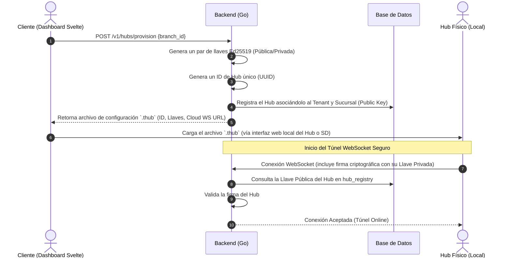
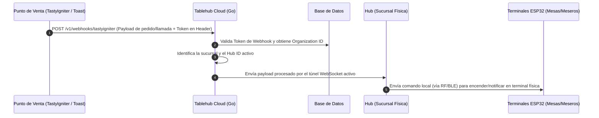
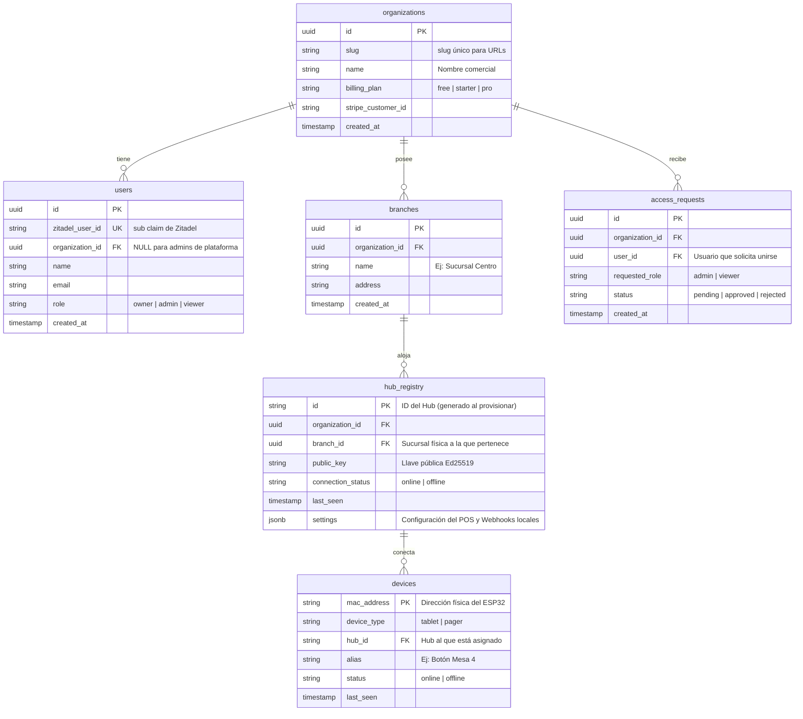

# Arquitectura de Tablehub: Hub Open-Source, Conectividad y Modelo SaaS (Revisado)

Este documento detalla la arquitectura técnica de Tablehub, orientada a un ecosistema de software libre y hardware abierto (hubs y terminales ESP32), y cómo se integra con el servicio opcional de Tablehub Cloud (SaaS) y sistemas POS (TastyIgniter, Toast, etc.).

---

## 1. Filosofía del Hub: Open-Source y Descentralizado

El Hub de Tablehub es un dispositivo con software libre y configurable. Los usuarios tienen total libertad sobre cómo desplegarlo y comunicarlo con sus terminales físicas (ESP32):

### Esquema A: Despliegue Standalone / Autogestionado (Gratuito)
* **Descripción:** El usuario descarga el firmware/software del Hub y lo corre en su propia infraestructura local (ej. una Raspberry Pi o servidor local).
* **Conectividad:**
  - El usuario es responsable de exponer sus puertos o configurar su propio túnel (ej. Cloudflare Tunnel, Tailscale o apertura de puertos con reglas de firewall).
  - El usuario debe configurar manualmente los webhooks desde su sistema POS directamente hacia su dirección IP pública/túnel autogestionado.
  - No hay dependencia de la nube de Tablehub.

### Esquema B: Tablehub Cloud SaaS (Fácil, Seguro y Administrado)
* **Descripción:** El cliente contrata la nube de Tablehub para simplificar la gestión. 
* **Conectividad:**
  - El Hub establece una conexión saliente WebSocket (túnel TCP reverso) segura contra la nube de Tablehub. No requiere abrir puertos en el router del restaurante ni configurar firewalls.
  - La nube de Tablehub centraliza los webhooks de los POS (TastyIgniter, Toast, etc.) y los retransmite en tiempo real de forma segura a través del WebSocket hacia el Hub físico en la sucursal.
  - Permite gestionar múltiples sucursales de forma unificada desde un único Dashboard web en Svelte.

---

## 2. Flujo de Provisionamiento y Conexión de Hubs en la Nube

Para conectar un Hub open-source a la nube de Tablehub, se utiliza un flujo criptográfico basado en llaves asimétricas (Ed25519) generado de forma programática:



### El archivo de configuración `.thub`
El payload generado por el backend de Go contiene la información necesaria para que el Hub autogestionado sepa a dónde y cómo conectarse a la nube:
```json
{
  "hub_id": "84d5df68-96bb-49e0-8208-f40445d4ea81",
  "organization_id": "3b2eb519-724e-4f32-bb91-4cf15d2925b6",
  "public_key": "4cdae8623ff...",
  "private_key": "1298ef9a02bc...",
  "cloud_url": "wss://tunnel.tablehub.app/v1/ws/connect"
}
```

---

## 3. Integración POS y Enrutamiento de Webhooks

Una de las ventajas del modelo SaaS es simplificar la integración con puntos de venta (POS) externos. La nube actúa como un proxy seguro en tiempo real:



---

## 4. Estructura y Jerarquía de Datos (Multi-Tenant)

El esquema relacional de base de datos en PostgreSQL para soportar este flujo de provisionamiento y control de sucursales:



---

## 5. Movimiento de Terminales ESP32 entre Hubs

En un restaurante, las terminales ESP32 (botones de llamado o tablets) pueden moverse de una sucursal a otra o ser reasignadas físicamente a otra zona:

1. **Escucha:** El ESP32 se comunica localmente por radiofrecuencia (LoRa/BLE) con el Hub más cercano.
2. **Detección de Cambio:** Cuando un ESP32 (identificado por su MAC) es detectado por el `Hub B`, este notifica a la Nube.
3. **Regla de Seguridad de la Nube:**
   - La nube verifica si el `Hub A` (donde estaba registrado) y el `Hub B` (el nuevo origen) pertenecen a la **misma organización**.
   - Si pertenecen a la misma organización, actualiza el `hub_id` en la tabla `devices`. Esto permite mover terminales libremente dentro del mismo negocio.
   - Si pertenecen a organizaciones distintas, bloquea la comunicación (evita robo o cruce accidental de señales entre restaurantes vecinos).

---

## 6. Modelo de Negocio y Facturación Flexible

Para el cobro del servicio SaaS (opcional), el cliente puede elegir entre:
1. **Pago por Sucursal Activa:** Se cobra un costo mensual por sucursal física configurada (Stripe `quantity`).
2. **Paquetes por Recursos:** Planes cerrados que limitan el número de Sucursales y Hubs que se pueden provisionar en la nube.
3. **Híbrido:** Un plan base con cierta cantidad de sucursales incluidas, y cobro de sucursales adicionales como add-ons.
