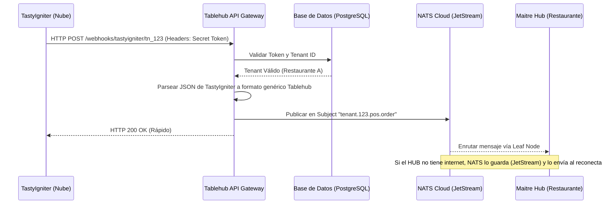

# Integración Cloud POS: Backend (SaaS API Gateway)

Este documento detalla cómo el Backend de Tablehub SaaS en la nube maneja las peticiones entrantes desde los Cloud POS (TastyIgniter, Toast, etc.) y las envía al Maitre Hub local.

## 1. Arquitectura del Flujo



## 2. Componentes del Backend

### A. Endpoint de Recepción (Webhook Handler)
El backend expondrá URLs públicas y dinámicas por cada restaurante:
`POST https://api.tablehub.io/v1/webhooks/{provider}/{tenant_id}`

Ejemplo: `/webhooks/tastyigniter/tn_9a8b7c6d5e`

### B. Validación de Seguridad (Middleware)
No podemos confiar ciegamente en las peticiones HTTP. Cuando llega el POST:
1. El middleware extrae el **Secret Token** de los headers (ej. `X-Signature` o `Authorization`).
2. Lo compara con el hash almacenado en la base de datos para ese `{tenant_id}`.
3. Si falla, devuelve `HTTP 401 Unauthorized` al POS.
4. Si es válido, la petición pasa al traductor.

> [!IMPORTANT]
> Los Webhook Tokens deben guardarse encriptados o hasheados en la base de datos (como contraseñas con bcrypt o SHA-256) para que, en caso de filtración de la BD, nadie pueda falsificar pedidos.

### C. Traductor de Payloads (Parser)
Cada POS envía los datos de forma diferente. TastyIgniter tiene un JSON, Toast tiene otro.
El backend usa el `{provider}` de la URL para saber qué "Traductor" usar.
- Toma el JSON específico de TastyIgniter.
- Extrae: Número de orden, ítems, modificadores, nombre del cliente.
- Lo transforma a un `StandardTablehubOrder{}` (el formato universal que entiende el Maitre Hub local).

### D. Puente hacia NATS (Publisher)
Una vez el JSON está estandarizado, el Backend ya no hace más trabajo HTTP. 
Se conecta al servidor NATS de la nube y publica el mensaje en un canal privado del restaurante:

```go
subject := fmt.Sprintf("tenant.%s.pos.order.received", tenantID)
payload, _ := json.Marshal(standardOrder)

// Usamos JetStream para garantizar entrega
_, err := js.Publish(subject, payload)
```

## 3. Gestión del Estado (Offline Mode)

La magia ocurre después del `js.Publish`. 
Al usar NATS JetStream en el SaaS:
1. **Respuesta Rápida:** El backend responde `200 OK` al POS inmediatamente después de guardar en NATS. El POS no se queda colgado esperando.
2. **Cola de Mensajes:** NATS intentará enviar el mensaje por el "Leaf Node" (la conexión persistente) hacia la IP local del restaurante.
3. **Corte de Internet:** Si el restaurante no tiene internet, el mensaje no se pierde. NATS Cloud lo retiene en disco de forma segura.
4. **Reconexión:** Cuando el router del restaurante vuelve a tener internet, el Maitre Hub se reconecta al SaaS automáticamente. NATS Cloud le envía todos los pedidos acumulados en el orden exacto en que llegaron.

## 4. Base de Datos (Estructura Sugerida)

Se necesitará una tabla `pos_integrations`:
- `id` (UUID)
- `tenant_id` (Relación al Restaurante)
- `provider` (String: "tastyigniter", "toast", etc.)
- `webhook_url_slug` (String único: "tn_9a8b7c6d5e")
- `hashed_secret_token` (String: Hash bcrypt del token visible al usuario)
- `is_active` (Booleano)
- `last_webhook_received_at` (Timestamp: Para actualizar el puntito verde del UI)

## Actualizaciones y Evolución (Plan de Implementación NATS)

Tras el análisis de la base de código actual (utilizando Deepseek), se detectó que los adaptadores para TastyIgniter ya están implementados parcialmente (`cloud/internal/infrastructure/webhook/tastyigniter.go`), pero el sistema actual de retransmisión depende de un túnel manual de WebSockets (`cloud/internal/application/webhook/dispatch_webhook.go`).

Para cumplir con la arquitectura robusta delineada en este documento, el plan de implementación inmediato es la migración a **NATS JetStream (Leaf Nodes)**:

1. **Modificar `ReceiveWebhookUseCase`:** En lugar de llamar a la lógica de WebSocket (`DispatchWebhookUseCase`) tras recibir el payload estandarizado de `TastyIgniterProvider`, se publicará directamente a NATS Cloud JetStream en el topic correspondiente al restaurante (ej. `tenant.{tenant_id}.pos.order`).
2. **Depreciar Túnel WebSocket:** Remover o dejar como fallback el antiguo sistema de túnel WebSocket (`dispatch_webhook.go`).
3. **Suscripción Local:** El Maitre Hub local (`hub/internal/web/server.go`) cambiará su escucha de WebSockets a una suscripción en NATS Leaf Node para garantizar la entrega segura de pedidos aunque ocurran desconexiones temporales.
