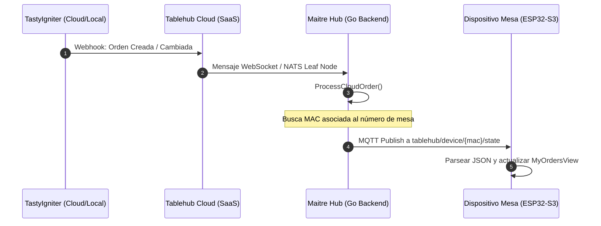

# Plan de Diseño: Sincronización de Pedidos en Vivo (TastyIgniter ↔ Hub ↔ ESP32)

Este documento define la arquitectura y el plan de implementación para sincronizar el estado de los pedidos que llegan desde TastyIgniter (o cualquier POS integrado en la nube) hacia el Maitre Hub local, y finalmente hacia las pantallas de mesa (ESP32) mediante mensajería MQTT.

---

## 1. Arquitectura del Flujo de Datos

El flujo transaccional se compone de 4 etapas:



1. **TastyIgniter (POS):** Dispara un webhook HTTP cuando una orden cambia de estado (ej. de "Recibido" a "En Cocina" o "Listo").
2. **Tablehub Cloud (SaaS):** Normaliza el payload al formato común y lo envía al Hub local.
3. **Maitre Hub (Go):** Procesa la orden en `ProcessCloudOrder`, identifica la mesa, busca el dispositivo correspondiente en la base de datos local SQLite, y publica el estado de las órdenes del cliente al broker MQTT embebido.
4. **Dispositivo Mesa (ESP32):** Recibe el mensaje MQTT en su callback y actualiza la interfaz gráfica neumórfica en la vista de "Mis Pedidos".

---

## 2. Cambios en el Backend del Hub (Go)

### 2.1. Conexión del Puente NATS ➔ MQTT en `hub/internal/events/jetstream.go`
Actualmente, `ProcessCloudOrder` en `hub/internal/web/server.go` publica la orden en el canal NATS `tablehub.table.{table_number}.order`.
Debemos implementar una suscripción JetStream a `tablehub.table.*.order` que se encargue de:
1. Extraer la mesa y la lista de platillos.
2. Buscar en la base de datos el dispositivo (MAC) activo asociado a esa mesa.
3. Traducir el pedido al formato plano simplificado que espera el ESP32:
   ```json
   {
     "orders": [
       {"name": "Hamburguesa Clásica", "status": "En Cocina", "progress": 40},
       {"name": "Papas Fritas", "status": "Listo", "progress": 100}
     ]
   }
   ```
4. Publicar mediante MQTT al tópico `tablehub/device/{mac}/state`.

### 2.2. Adaptación de la Base de Datos en `hub/internal/db/devices.go`
Asegurarse de tener una consulta eficiente para obtener un dispositivo activo a partir de su número de mesa:
```go
func GetActiveDeviceByTable(tableNumber string) (*Device, error)
```

---

## 3. Cambios en el Firmware (ESP32)

### 3.1. Validación del Callback en `firmware/src/Network/MQTTService.cpp`
El firmware ya está suscrito a `tablehub/device/{mac}/state` y tiene implementada la función `mqttCallback`:
* Extrae el array `orders`.
* Llama al callback registrado `ordersCb(ordersList)`.
* Debemos verificar que este flujo procese correctamente los nombres largos y estados de los platillos.

### 3.2. Actualización Dinámica en `firmware/src/UI/Views/MyOrdersView.cpp`
* Validar que la interfaz neumórfica se redibuje limpiamente al recibir actualizaciones del callback de órdenes.
* El progreso de la barra se ajusta dinámicamente según el porcentaje enviado por el Hub (ej: 0% en espera, 50% en cocina, 100% servido).

---

## 4. Notas y Consideraciones de Seguridad
* **Validación de Firmas:** Las actualizaciones salientes del Hub hacia el dispositivo no requieren firma Ed25519 en el dispositivo (ya que el dispositivo confía en los mensajes que recibe en su canal privado suscrito del broker MQTT local tras haberse autenticado), pero el canal MQTT debe estar protegido con credenciales únicas por placa generadas durante el aprovisionamiento.
* **Persistencia:** Si el ESP32 se reinicia, al conectarse a MQTT enviará su telemetría y el Hub le retransmitirá de inmediato el estado actual de las órdenes activas en esa mesa.

---

## 5. Evolución: Enfoque Centrado en la Orden y no en la Mesa
*   **Aclaración de Diseño:** Tras la retroalimentación del usuario, el sistema **no** cambiará de forma proactiva el estado operativo o logístico de la "Mesa" (ej: Ocupada/Libre) de manera rígida.
*   **Enfoque de Sincronización:** El Maitre Hub y el ESP32 se enfocarán exclusivamente en el **estado de preparación y entrega de los pedidos (órdenes) individuales** cargados a esa mesa en TastyIgniter. 
*   **Mapeo de Estados de la Orden:** Los estados de preparación reportados por TastyIgniter/POS se mapearán directamente a los platos e ítems mostrados en la pantalla, permitiendo al comensal saber exactamente cuándo cada plato de su orden particular pasa de *"Recibido" ➔ "En Cocina" ➔ "Servido"*.
*   **Jerarquía de Tópicos MQTT Específica por Orden:**
    *   Para evitar colisiones o confusiones de órdenes y poder mostrar con claridad el número de pedido en la pantalla del dispositivo, la jerarquía de tópicos se actualizará a:
        `tablehub/device/{mac}/order/{order_id}/state`
    *   El firmware del ESP32 se suscribirá utilizando el wildcard `tablehub/device/{mac}/order/+/state`.
    *   Al recibir un mensaje, el firmware extraerá el `{order_id}` del tópico o del payload para mostrar arriba en la UI de *Mis Pedidos* (ej: *"Pedido #1234"*), brindando total claridad al comensal sobre qué orden está visualizando.


