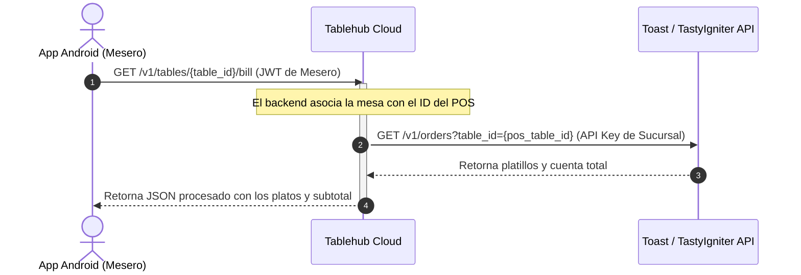

# Roadmap: Aplicación Móvil de Meseros e Integración Transaccional POS

Este documento detalla el roadmap y la arquitectura para la futura **Aplicación Móvil Android de Meseros** y su integración en tiempo real con los sistemas POS (TastyIgniter, Toast, Clover, etc.) a través de Tablehub Cloud.

---

## 1. Visión General de la App de Meseros (Android)

La aplicación de meseros es el canal de notificación local y de visualización en tiempo real de lo que ocurre en el piso del restaurante (salón, mesas y barras). 

### Funciones Principales de la App:
* **Alertas en Tiempo Real:** Notificaciones instantáneas (vía WebSockets o Push Notifications) cuando un cliente presiona un botón físico (ESP32) en su mesa.
* **Detalle del Llamado:** Indica qué tipo de llamado es (Ej: *"Pedir la cuenta"*, *"Llamar mesero"*, *"Agregar platillo"*).
* **Ubicación Exacta:** Muestra a qué salón/zona pertenece la mesa, en qué sucursal y a qué Hub físico está conectada.
* **Consulta Transaccional (POS Sync):** Visualización en tiempo real del estado de la mesa (platillos ordenados, cuenta parcial, estado de preparación) consultando directamente las APIs de Toast / TastyIgniter.

---

## 2. Flujo de Datos Transaccional (Tablehub <=> POS)

Para que el mesero pueda ver la cuenta y los platillos desde la app móvil, el backend de Tablehub actuará como un puente seguro (Proxy API) hacia el POS del restaurante:



---

## 3. Arquitectura de Salones y Sucursales (Multi-Tenant)

Para soportar múltiples salones y sucursales donde los meseros puedan estar asignados a zonas específicas, estructuramos los datos de la siguiente manera:

* **Sucursales (`branches`):** Permite filtrar los llamados y mesas de la sucursal activa del mesero.
* **Salones/Zonas (`lounges`/`zones`):** Subdivisiones dentro de una sucursal (ej: *"Terraza"*, *"Salón Principal"*, *"Barra"*).
* **Asignación Dinámica:** Los meseros pueden asignarse a una zona específica para recibir únicamente alertas de las mesas que están bajo su cuidado, evitando saturación de notificaciones.

---

## 4. Comunicación Híbrida (Nube vs. Red Local Wi-Fi)

Para garantizar la disponibilidad del servicio ante caídas del servicio de internet de la sucursal, Tablehub implementa un mecanismo de redundancia dual:

1. **Modo Nube (SaaS):** Los eventos viajan de la terminal (ESP32) -> Hub local -> Tablehub Cloud -> App de Mesero (vía Push/WebSockets). Este modo es el estándar y permite monitorear métricas, tiempos de respuesta de meseros e historial de alertas.
2. **Modo Local Offline (Wi-Fi de Emergencia/Standalone):** Si el Hub detecta que no hay conexión a internet:
   - El Hub activa un servidor WebSocket local en el puerto del dispositivo dentro del restaurante.
   - Las apps Android de los meseros, al detectar la pérdida de conexión con la nube, buscan en la red Wi-Fi local el Hub y se conectan a él directamente de forma inalámbrica.
   - Los llamados de las mesas se siguen despachando en tiempo real de forma 100% local, garantizando que el restaurante siga operando.

### 4.1 Autenticación y Login Local Seguro (Modo Offline)

Cuando el sistema opera en modo offline local, el servicio OIDC de Zitadel en la nube es inaccesible. Para garantizar la seguridad del acceso del personal sin comprometer el Hub:
* **Sesiones por JWT Locales:** Al iniciar sesión exitosamente contra la IP del Hub local, el backend del Hub emite un token JWT local firmado con una llave secreta efímera (generada aleatoriamente en el primer arranque del dispositivo) para validar las siguientes peticiones de la App Android.

### 4.2 Gestión de Sesiones Seguras: Ciclo de Refresco (Access & Refresh Tokens)

Para blindar la seguridad de la app móvil (APK) sin molestar a los meseros obligándolos a reintroducir su contraseña constantemente, se implementará el ciclo de refresco estándar de OAuth2:

* **Access Token (Corta Duración):**
  - Duración: 15 minutos.
  - Se envía en la cabecera `Authorization: Bearer <token>` para autorizar todas las peticiones a la API.
  - Al expirar, cualquier petición responderá con `401 Unauthorized`.
* **Refresh Token (Larga Duración):**
  - Duración: 30 días (o expira al cerrar sesión manualmente).
  - Almacenado de forma segura en el almacenamiento encriptado del dispositivo (`EncryptedSharedPreferences`).
  - No se envía a las APIs de mesas ni de órdenes; solo sirve para comunicarse con el servidor de autenticación (Zitadel en modo online, o el Hub en modo offline) para renovar el Access Token.
* **Rotación de Refresh Tokens (Security Rotation):**
  - Cada vez que la APK solicita un nuevo Access Token usando un Refresh Token, el servidor invalida el Refresh Token anterior y le entrega uno nuevo a la APK.
  - Si un atacante robase un Refresh Token antiguo e intentara usarlo, el servidor detectaría la reutilización y revocaría inmediatamente todas las sesiones activas de ese usuario por seguridad.

---

## 5. Abstracción y Adaptadores POS (Toast vs. TastyIgniter vs. Clover)

No todos los sistemas de punto de venta (POS) tienen el mismo nivel de madurez tecnológica o manejan "alertas de mesas" en sus tablets. Tablehub soluciona esto a través de un **Patrón Adaptador (POS Adapter Pattern)** en el backend de Go:

```
                            ┌──> Adaptador Toast ───> Petición API (Notificación en Tablet)
                            │
Evento Botón ──> Tablehub ──┼──> Adaptador Tasty ───> Webhook local (Orden / Alerta)
                            │
                            └──> Standalone ────────> Alerta exclusiva en App de Meseros
```

### Categorías de Integración POS:
1. **POS Modernos y Conectados (Toast, Clover):** Cuentan con soporte nativo de mesas y notificaciones para meseros. Tablehub reenvía el llamado de la mesa a la API del POS para que el mesero vea el aviso directamente en su pantalla del POS principal.
2. **POS Semi-estáticos (TastyIgniter, WooCommerce Food):** Manejan mesas y cuentas, pero no tienen un sistema de "notificaciones de piso". Tablehub lee la base de datos o API del POS para emparejar la cuenta/platillos de la mesa y muestra la alerta exclusivamente en la App de Meseros de Tablehub, consultando los platos de fondo.
3. **POS Standalone (Legacy/Sin API):** Para restaurantes que usan POS de caja básicos o sin conectividad de mesas. Tablehub funciona de forma autónoma: gestiona las mesas, las alertas y la cola de llamados de forma interna y exclusiva mediante su propio panel de Svelte y su App de Meseros, sin necesidad de integrarse con el POS.

---

## 6. Modo Standalone Completo: Menú Digital, Micro-POS y KDS Local

Para aquellos restaurantes que no están modernizados, no cuentan con un POS externo, o eligen no pagar el servicio de sincronización en la nube, Tablehub ofrece una suite local integrada que corre directamente sobre el hardware del local (con o sin internet):

### Funcionalidades Standalone:
1. **Menú Digital Básico (Código QR):**
   - El restaurante carga su catálogo de platillos y precios directamente en la interfaz local de Tablehub.
   - Cada mesa tiene un código QR único que los comensales escanean para ver el menú y solicitar mesero o la cuenta.
2. **Micro-POS Local:**
   - Un punto de venta sumamente sencillo e intuitivo para que el mesero (desde la app Android) o el cajero puedan tomar órdenes, agregar platos a una mesa y registrar el pago básico.
3. **KDS Local (Kitchen Display System):**
   - Una pantalla web simple para la cocina que enlista en tiempo real las comandas/platillos ordenados por los meseros, permitiendo a los cocineros marcarlos como preparados para que el mesero reciba una alerta automática de "Platillo Listo".

---

## 7. Fases del Roadmap

### Fase 1: Notificación e Infraestructura (Q3 2026)
* **Nube (Tablehub Cloud):**
  - Implementar servicio de WebSockets optimizado para conexiones móviles de la App de Meseros.
  - Endpoint `GET /v1/orgs/{org_id}/hubs` que exponga la información de registro y llaves públicas de los Hubs autorizados.
  - Integración de roles a nivel de sucursal en Zitadel.
* **Hub Físico:**
  - Generar un par de llaves (Pública/Privada) en el primer arranque del dispositivo.
  - Implementar descubrimiento UDP/mDNS en la red local.
  - Endpoint local `POST /api/local-auth/challenge` para firmar desafíos criptográficos con su llave privada.
* **APK (Android):**
  - Descargar y cachear las llaves públicas de los Hubs autorizados de la sucursal desde Tablehub Cloud.
  - Implementar el cliente mDNS y el flujo de validación challenge-response contra el Hub descubierto localmente.

### Fase 2: Integración de Menú y Cuenta POS (Q4 2026)
* **Nube & Hub:**
  - Conectar las APIs de TastyIgniter y Toast para leer el estado de la cuenta por mesa.
  - Desarrollar módulo de carga de Menú Digital y Micro-POS local para uso Standalone (ejecutable directamente en el Hub).
* **Nube (Tablehub Cloud) - Flujo de Conversión:**
  - Implementar endpoint de regeneración y firma dinámica del archivo `.thub` tras la facturación/suscripción en Stripe.
  - Endpoint de sincronización API para recibir y migrar la base de datos de salones/mesas desde el Hub local.
* **Hub Físico - Flujo de Conversión:**
  - Implementar disparador local "Conectar a la Nube" que consuma el token OIDC del administrador, descargue el `.thub` final y realice la carga inicial de base de datos a la Nube.
  - Switch en caliente de WebSocket local a WebSocket de túnel saliente a `wss://cloud.tablehub.com/ws`.
* **APK (Android) - Flujo de Conversión:**
  - Cachear el estado del pedido localmente (Room DB) para soportar el modo offline.
  - Permitir al mesero marcar llamados como "Atendidos", enviando el evento al Hub para apagar el LED físico.
  - Switch dinámico de autenticación: pasar de validar contra el endpoint local del Hub a validar tokens emitidos por Zitadel Cloud.

### Fase 3: App Nativa Android & KDS (Q1 2027)
* **APK (Android):**
  - Desarrollo de la interfaz nativa final y soporte de notificaciones WearOS (relojes inteligentes).
  - Implementar la vista del KDS (Kitchen Display System) local para tablets o monitores de cocina.

