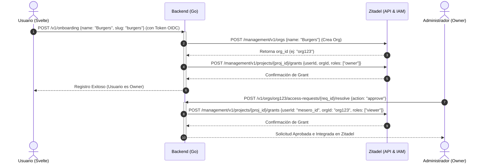

# Plan de Control de API de Zitadel e Integración de Permisos (Borrador)

Este documento describe la arquitectura para delegar la autenticación, multi-tenancy (organizaciones) y control de acceso (roles/RBAC) a **Zitadel**, controlado programáticamente desde nuestro backend en Go.

---

## 1. Arquitectura de Integración (Zitadel API Control)

El backend de Go actúa como un orquestador. El frontend (Svelte) o los usuarios finales nunca interactúan con las pantallas administrativas de Zitadel. Todo ocurre de forma transparente mediante peticiones a la **Management API** de Zitadel utilizando una llave de servicio de máquina (`zitadel-admin.json`).



---

## 2. API Endpoints de Zitadel a Utilizar

Para interactuar con Zitadel, el backend requiere autenticarse usando la llave de máquina para obtener un Token de Acceso OAuth (`/oauth/v2/token`). Luego, utiliza los siguientes endpoints de Zitadel:

### A. Crear Organización (Tenant)
* **Endpoint:** `POST https://{your-zitadel-domain}/management/v1/orgs`
* **Cabeceras:**
  - `Authorization: Bearer <access_token>`
  - `Content-Type: application/json`
* **Cuerpo de la Petición:**
  ```json
  {
    "name": "Hamburguesas Central"
  }
  ```
* **Respuesta:**
  ```json
  {
    "details": {
      "sequence": "12",
      "changeDate": "2026-07-12T00:00:00Z",
      "resourceOwner": "org123"
    },
    "orgId": "24985210385920385"
  }
  ```

### B. Otorgar Acceso al Proyecto en la Organización (User Grant)
Una vez creada la organización, debemos permitir que el usuario acceda a nuestro Proyecto (`tablehub`) bajo el contexto de su organización con un rol específico (`owner`, `admin`, `viewer`).
* **Endpoint:** `POST https://{your-zitadel-domain}/management/v1/users/{user_id}/grants`
* **Cuerpo de la Petición:**
  ```json
  {
    "projectId": "19230581938593028",
    "roleKeys": ["owner"]
  }
  ```
  *(Nota: Se especifica la cabecera `x-zitadel-orgid: {org_id}` para apuntar el grant a la organización del cliente).*

---

## 3. Estructura del Token JWT y Autorización en el Backend

Al configurar Zitadel con la opción **Project Role Assertion** activa, cada vez que un usuario se loguea y solicita un token de acceso, Zitadel inyecta los roles y la organización en el JWT dentro de la claim `urn:zitadel:iam:org:project:roles`.

### Estructura del JWT
```json
{
  "iss": "http://localhost:8088",
  "sub": "2394852938459",
  "aud": "381303699831521795",
  "exp": 1783850000,
  "urn:zitadel:iam:org:project:roles": {
    "owner": {
      "24985210385920385": "Hamburguesas Central"
    }
  }
}
```
*En este ejemplo:*
* El rol del usuario es **`owner`**.
* El ID de la organización (tenant) a la que pertenece es **`24985210385920385`**.

### Lógica de Validación en Go (Bypass de DB para Lectura)
Nuestro backend valida la firma criptográfica del JWT (usando JWKS) y mapea las claims de forma instantánea sin ir a la base de datos:

```go
type CustomClaims struct {
	jwt.RegisteredClaims
	Roles map[string]map[string]string `json:"urn:zitadel:iam:org:project:roles"`
}

// Extrae el rol y organización del token
func (c *CustomClaims) GetOrgAndRole() (string, string) {
	for role, orgs := range c.Roles {
		for orgID := range orgs {
			return orgID, role // Retorna la primera relación encontrada
		}
	}
	return "", ""
}
```

---

## 4. Comparativa de Enfoques para Discusión

| Característica | Enfoque Base de Datos Local | Enfoque API de Zitadel (Propuesto) |
| :--- | :--- | :--- |
| **Fuente de Verdad** | Base de Datos PostgreSQL local. | Zitadel (Base de datos local solo copia de apoyo). |
| **Carga de Datos al Loguear** | Requiere consulta SQL a la tabla `users` para ver el rol. | Carga instantánea desde el token JWT decodificado en memoria. |
| **Complejidad de Onboarding** | Simple `INSERT` local. | Llamada HTTP saliente a Zitadel API para crear Org y Grants. |
| **Consistencia de Zitadel** | Zitadel no sabe nada de los roles; es solo un login plano. | Zitadel sabe exactamente quién pertenece a qué y qué permisos tiene. |
| **Aprobación de Accesos** | Actualiza la tabla `users` localmente. | Llama a la API de Zitadel para crear/actualizar el User Grant. |
| **Seguridad de Tokens** | Las claims de roles locales no viajan en el JWT. | El JWT contiene criptográficamente el rol y la organización firmados. |
